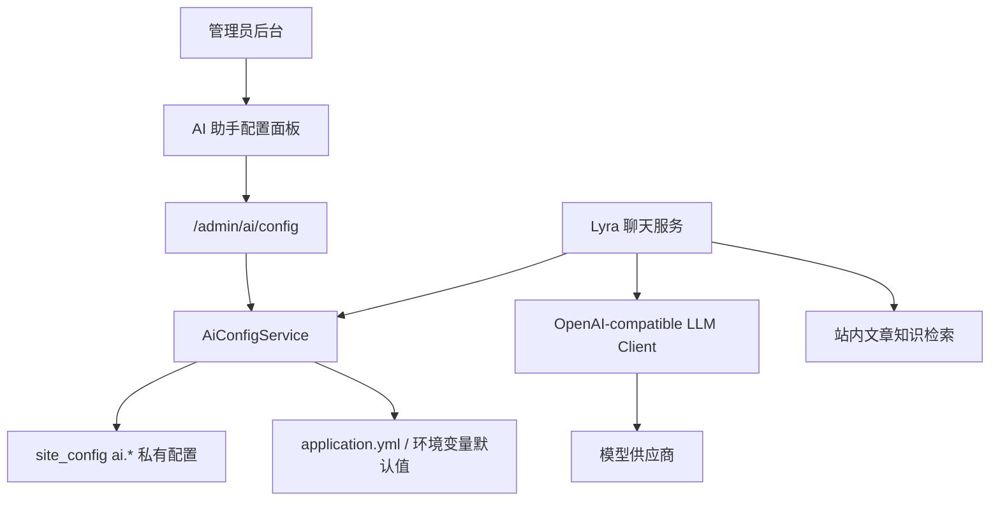

# AI 女仆后台配置设计

## 1. 背景

当前 Chen404 已经具备基础 AI 能力，包括文章 AI 辅助、Lyra 女仆聊天、站内文章知识切片、会话持久化和 SSE 流式输出。现有配置主要来自 `application.yml`、环境变量和 prompt 模板文件，适合部署时配置，但不适合日常调试 Lyra 的模型参数、人设、检索策略和小气泡表现。

这会带来几个问题：

- 调整模型、温度、token 数、baseUrl 等参数需要修改环境变量或配置文件，反馈周期长。
- API Key、模型连接状态和运行时开关缺少后台可视化管理。
- Lyra 的人设 prompt、helper prompt、companion prompt 不方便快速迭代。
- 站内检索、推荐文章、引用数量、小气泡短句策略等产品参数无法在后台直接调整。
- 小气泡和聊天面板没有完全分层，长回答容易出现在人物旁边，影响视觉体验。

因此需要新增一套后台 AI 配置管理能力，让管理员可以安全、可控地调整 Lyra 的 AI 调用与交互策略。

## 2. 设计目标

本设计目标不是把项目改造成完整 AI 平台，而是为 Lyra 提供一套足够实用、边界清晰、可持续演进的后台配置中心。

核心目标：

1. 管理员可以在后台调整 AI 模型调用参数。
2. API Key 可以写入和更新，但不能被前端明文读取。
3. Lyra 的名称、人设版本和 prompt 可以通过后台维护。
4. 聊天策略可以配置，包括站内检索、引用数量、上下文长度、推荐数量、小气泡短句策略。
5. 后台可以测试模型连接，降低线上配置错误风险。
6. 运行时优先使用数据库配置，未配置时回退到 `application.yml` 或环境变量。
7. 公共接口不暴露 AI 敏感配置。
8. 为后续站内工具调用和可选联网搜索预留配置入口。

## 3. 非目标

第一阶段不做以下内容：

- 不实现完整 OpenAI function calling / tool calling 闭环。
- 不实现真正的联网搜索结果抓取与引用。
- 不做多供应商密钥池或模型路由。
- 不做按用户、按页面、按场景的复杂模型策略。
- 不做 prompt 多版本回滚和 A/B 测试，只保留恢复默认的扩展空间。

这些能力可以在后台配置中心稳定后继续扩展。

## 4. 总体架构

新增一条独立的后台 AI 配置链路，和现有公开站点配置解耦。



运行时配置解析规则：

1. 后台数据库配置优先。
2. 数据库配置为空时，回退到已有配置类。
3. 敏感字段只在服务端使用。
4. 公共接口只返回站点公开信息，不返回 AI 配置。

## 5. 后台配置范围

### 5.1 模型连接配置

后台支持配置：

- 是否启用 LLM。
- `baseUrl`。
- `model`。
- `apiStyle`，支持 `chat-completions` 和 `responses`。
- API Key。
- `temperature`。
- `maxTokens`。
- `timeoutSeconds`。

API Key 处理规则：

- 保存时允许写入新 key。
- 查询时不返回明文 key。
- 查询时只返回 `apiKeyConfigured` 和 `apiKeyPreview`。
- 如果保存请求里的 `apiKey` 为空字符串，表示保留原 key。
- 如果保存请求里的 `apiKey` 有内容，表示替换 key。

示例展示：

```json
{
  "apiKeyConfigured": true,
  "apiKeyPreview": "sk-****3456",
  "apiKey": null
}
```

### 5.2 Lyra 人设配置

后台支持配置：

- 女仆名称。
- 人设版本。
- system prompt。
- helper prompt。
- companion prompt。

建议在后台 UI 中把 prompt 放入“高级设置”，避免误操作。后续可以增加“恢复默认 prompt”按钮，从 classpath 模板重新加载默认内容。

### 5.3 聊天策略配置

后台支持配置：

- 是否启用 AI 聊天。
- 是否启用站内检索。
- 最大引用数量。
- 最大上下文消息数。
- 当前文章正文注入长度。
- 当前文章摘要注入长度。
- 快捷追问数量。
- 相关文章数量。
- 是否必须有推荐意图才返回相关文章。
- 小气泡最大字符数。
- 长回复小气泡兜底文案。

默认小气泡兜底文案：

```text
我整理好了，打开聊天框看详细内容吧。
```

### 5.4 工具配置预留

第一阶段只保留：

- 是否启用 `webSearchEnabled`。

该开关暂不代表已经完成联网搜索能力。它是为后续接入 web search、外部搜索 API 或 OpenAI 内置搜索能力预留的显式开关。

## 6. 数据存储设计

为了减少表结构复杂度，第一阶段复用现有 `site_config` 表，但 AI 配置全部使用 `is_public = 0`，并通过 admin-only 接口读写。

配置 key 统一使用 `ai.*` 前缀。

### 6.1 LLM 配置

| Key | 类型 | 默认值 | 说明 |
| --- | --- | --- | --- |
| `ai.llm.enabled` | boolean | `false` | 是否启用模型调用 |
| `ai.llm.base_url` | text | `https://api.openai.com/v1` | 模型服务地址 |
| `ai.llm.model` | text | `gpt-5.4-mini` | 默认模型名 |
| `ai.llm.api_style` | text | `chat-completions` | API 风格 |
| `ai.llm.api_key` | text | 空 | API Key，仅服务端使用 |
| `ai.llm.temperature` | number | `0.2` | 输出随机性 |
| `ai.llm.max_tokens` | number | `512` | 最大输出 token |
| `ai.llm.timeout_seconds` | number | `30` | 请求超时时间 |

### 6.2 Lyra 配置

| Key | 类型 | 默认值 | 说明 |
| --- | --- | --- | --- |
| `ai.maid.name` | text | `Lyra` | 女仆名称 |
| `ai.maid.persona_version` | text | `v1.1` | 人设版本 |
| `ai.maid.system_prompt` | text | 空 | system prompt 覆盖值 |
| `ai.maid.helper_prompt` | text | 空 | 站内助手 prompt 覆盖值 |
| `ai.maid.companion_prompt` | text | 空 | 陪伴聊天 prompt 覆盖值 |

prompt 覆盖规则：

- 数据库为空时，继续使用 classpath prompt 文件。
- 数据库有值时，使用后台配置值。

### 6.3 聊天配置

| Key | 类型 | 默认值 | 说明 |
| --- | --- | --- | --- |
| `ai.chat.enabled` | boolean | `true` | 是否启用 Lyra 聊天 |
| `ai.chat.retrieval_enabled` | boolean | `true` | 是否启用站内检索 |
| `ai.chat.max_citation_count` | number | `3` | 引用数量上限 |
| `ai.chat.max_context_messages` | number | `8` | 注入 prompt 的历史消息数 |
| `ai.chat.max_article_content_chars` | number | `3000` | 当前文章正文最大注入长度 |
| `ai.chat.max_article_summary_chars` | number | `300` | 当前文章摘要最大注入长度 |
| `ai.chat.max_suggestion_count` | number | `3` | 快捷追问数量 |
| `ai.chat.related_article_limit` | number | `2` | 相关文章数量 |
| `ai.chat.require_recommend_intent_for_related_articles` | boolean | `true` | 是否仅在推荐意图下返回相关文章 |
| `ai.chat.bubble_max_chars` | number | `36` | 小气泡最大字符数 |
| `ai.chat.bubble_long_reply_text` | text | 见上文 | 长回复小气泡文案 |

### 6.4 工具配置

| Key | 类型 | 默认值 | 说明 |
| --- | --- | --- | --- |
| `ai.tools.web_search_enabled` | boolean | `false` | 是否允许后续联网搜索能力 |

## 7. 后端接口设计

新增后台接口统一放在：

```text
/api/admin/ai/config
```

所有接口必须加 `@RequireAdmin`。

### 7.1 获取 AI 配置

```http
GET /api/admin/ai/config
```

返回 `AiAdminConfigDTO`。

响应特点：

- 包含模型、人设、聊天策略和工具开关。
- 不返回 API Key 明文。
- 返回 `apiKeyConfigured` 和 `apiKeyPreview`。

### 7.2 更新 AI 配置

```http
PUT /api/admin/ai/config
```

请求体为 `AiAdminConfigDTO`。

保存规则：

- 对数值字段做范围裁剪。
- 对枚举字段做白名单校验。
- 对文本字段 trim。
- API Key 为空时保留旧值。
- API Key 有值时替换旧值。
- 所有 AI 配置写入 `site_config`，且 `is_public = 0`。

### 7.3 测试模型连接

```http
POST /api/admin/ai/config/test-connection
```

请求：

```json
{
  "message": "请用一句话介绍你自己。",
  "useUnsavedConfig": true,
  "config": {}
}
```

返回：

```json
{
  "success": true,
  "message": "连接成功",
  "sampleText": "你好，我是 Lyra。",
  "traceId": "trace_ai_config_xxx",
  "latencyMs": 1234
}
```

`useUnsavedConfig = true` 时，允许使用当前表单尚未保存的配置测试连接。

## 8. 后端服务设计

### 8.1 AiConfigService

新增服务接口：

```java
public interface AiConfigService {
    AiAdminConfigDTO getAdminConfig();
    AiAdminConfigDTO updateAdminConfig(AiAdminConfigDTO patch);
    AiAdminConfigDTO getEffectiveConfig();
    AiConfigTestResponse testConnection(AiConfigTestRequest request);
}
```

职责：

- 读取后台配置。
- 合成运行时有效配置。
- 保存后台配置。
- 处理 API Key 脱敏和保留逻辑。
- 提供模型连接测试。

### 8.2 配置合成规则

`getEffectiveConfig()` 合成顺序：

1. 从 `LlmProperties`、`AiRuntimeProperties`、`AiMaidProperties` 构建默认值。
2. 从 `site_config` 读取 `ai.*` 配置。
3. 数据库值非空时覆盖默认值。
4. 对配置做 normalize。
5. 返回服务端运行时可使用的完整配置。

### 8.3 LLM Client 改造

当前 `OpenAiCompatibleLlmClient` 主要读取全局 `LlmProperties`。

需要扩展 `LlmTextRequest`，允许单次请求传入：

- model。
- baseUrl。
- apiKey。
- apiStyle。
- temperature。
- maxTokens。
- timeoutSeconds。
- chatCompletionsPath。
- responsesPath。

解析规则：

```text
request override > LlmProperties default
```

这样后台配置才能不重启服务就影响 Lyra 的模型调用。

## 9. Lyra 聊天链路调整

### 9.1 当前链路

当前简化链路：

```text
前端 Live2D
  -> /ai/chat 或 /ai/chat/stream
  -> AiChatServiceImpl
  -> 场景判断 helper / companion
  -> 可选文章知识检索
  -> MaidChatScenarioDefinition
  -> LlmClient
  -> AiChatResponse
```

### 9.2 新链路

新增配置注入：

```text
AiChatServiceImpl
  -> AiConfigService.getEffectiveConfig()
  -> 按配置判断是否启用聊天、站内检索、推荐、引用数量
  -> 使用配置生成 LlmTextRequest
  -> 返回 panelAnswer / bubbleText
```

### 9.3 回复展示分层

后端响应新增：

```java
private String panelAnswer;
private String bubbleText;
```

兼容字段：

```java
private String replyText;
```

兼容策略：

- `replyText` 暂时等于 `panelAnswer`。
- 前端新版本优先使用 `panelAnswer` 和 `bubbleText`。
- 老前端继续使用 `replyText` 不会立即坏掉。

### 9.4 小气泡规则

小气泡只负责情绪反馈，不承载完整答案。

规则：

- 面板打开时，小气泡隐藏。
- 短回复可直接作为小气泡。
- 超过 `bubbleMaxChars` 时，使用 `bubbleLongReplyText`。
- 流式回复过程中，不把完整 delta 持续写入小气泡。
- 流式回复时，小气泡只显示“我在整理”类短句。

## 10. 前端后台设计

在 `AdminSiteSettings.vue` 中新增 `AI 助手` tab，具体配置表单拆成独立组件：

```text
src/views/Admin/components/AiAssistantSettings.vue
```

页面分区：

1. 模型连接。
2. Lyra 人设。
3. 聊天策略。
4. 高级 Prompt。

主要交互：

- 刷新配置。
- 保存配置。
- 测试连接。
- 重置为已保存配置。

API Key 输入框：

- 类型使用 password。
- placeholder 展示 `apiKeyPreview`。
- 留空表示保留旧 key。
- 输入新值表示替换 key。

## 11. 安全设计

### 11.1 权限

所有 AI 配置接口必须是 admin-only。

要求：

- Controller 使用 `@RequireAdmin`。
- 不复用公开 `/site/config` 响应。
- 不把 AI 配置放进任何游客可访问接口。

### 11.2 敏感信息

API Key 处理要求：

- 不在响应体返回明文。
- 不在日志输出明文。
- 不在前端状态里长期保存明文。
- 保存时允许覆盖，查询时只返回脱敏状态。

后续如果需要更高安全级别，可以把 `ai.llm.api_key` 加密存储，而不是明文放入 `site_config`。

### 11.3 配置校验

建议范围：

| 字段 | 范围 |
| --- | --- |
| `temperature` | `0.0 - 2.0` |
| `maxTokens` | `128 - 8192` |
| `timeoutSeconds` | `5 - 120` |
| `maxCitationCount` | `0 - 8` |
| `maxContextMessages` | `1 - 20` |
| `maxArticleContentChars` | `500 - 12000` |
| `maxArticleSummaryChars` | `80 - 1000` |
| `maxSuggestionCount` | `0 - 5` |
| `relatedArticleLimit` | `0 - 6` |
| `bubbleMaxChars` | `12 - 60` |

## 12. 测试策略

### 12.1 后端单元测试

重点测试：

- 默认配置合成。
- 数据库配置覆盖。
- API Key 脱敏。
- API Key 空字符串保留旧值。
- API Key 新值替换旧值。
- 数值字段范围裁剪。
- admin controller 响应不包含明文 key。
- Lyra 聊天使用后台配置。
- 关闭检索时不调用 `ArticleKnowledgeService`。
- 引用数量遵守后台配置。
- `panelAnswer` 和 `bubbleText` 正确返回。

### 12.2 前端构建测试

运行：

```powershell
cd Chen404Fro
npm run build
```

重点检查：

- `AiAdminConfig` 类型正确。
- 新增 API 函数类型正确。
- 后台 AI tab 构建通过。
- Live2D 使用 `bubbleText` 不破坏现有聊天。

### 12.3 手工验收

验收流程：

1. 管理员登录后台。
2. 打开站点配置。
3. 进入 `AI 助手` tab。
4. 配置模型名、baseUrl、API Key、maxTokens。
5. 点击测试连接。
6. 保存配置。
7. 前台打开文章页。
8. 问 Lyra：“帮我总结这篇文章。”
9. 确认聊天面板显示完整回答。
10. 确认人物旁小气泡只显示短句，或在面板打开时隐藏。

## 13. 分阶段实施建议

### 第一阶段：后台配置中心

完成：

- AI 配置 DTO。
- 数据库存储。
- admin-only 接口。
- 后台 AI 设置页。
- API Key 脱敏。
- 测试连接。

这一阶段完成后，管理员已经可以在后台调整模型连接和 Lyra 配置。

### 第二阶段：运行时接入

完成：

- `LlmTextRequest` 支持单次覆盖。
- `OpenAiCompatibleLlmClient` 使用后台配置。
- `AiChatServiceImpl` 使用有效配置。
- 检索、引用、推荐数量、小气泡策略全部由后台配置控制。

这一阶段完成后，后台配置会真正影响 Lyra 的线上表现。

### 第三阶段：表达分层和体验优化

完成：

- 后端返回 `panelAnswer` 和 `bubbleText`。
- 前端小气泡只读 `bubbleText`。
- 流式输出不再把长回复压到人物头顶。
- 面板打开时小气泡隐藏。

这一阶段完成后，Lyra 的视觉和聊天体验会更自然。

### 第四阶段：工具能力扩展

可选扩展：

- `search_articles`。
- `get_current_article`。
- `get_recent_articles`。
- `get_related_articles`。
- `search_site_profile`。
- `web_search`。

建议先做站内工具，再做联网搜索。联网搜索必须带来源、超时、开关和降级策略。

## 14. 风险与取舍

### 14.1 复用 site_config 的取舍

优点：

- 不新增表。
- 和现有配置管理方式一致。
- Flyway 迁移简单。

风险：

- `site_config` 会承载更多私有配置。
- 必须严格控制 `is_public = 0` 和接口边界。

如果后续 AI 配置变复杂，可以独立成 `ai_config` 表。

### 14.2 Prompt 后台可编辑的风险

优点：

- 调整快。
- 适合持续打磨 Lyra 性格。

风险：

- prompt 改坏会直接影响线上表现。
- 管理员误操作可能导致输出风格漂移。

缓解方式：

- prompt 放入高级设置。
- 增加恢复默认按钮。
- 后续增加 prompt 版本记录。

### 14.3 API Key 存储风险

第一阶段可以存入 `site_config`，但必须不返回明文。

更稳的后续方案：

- 使用服务端加密密钥加密保存。
- 或只允许环境变量配置 API Key，后台只展示状态。

## 15. 推荐落地顺序

推荐按以下顺序开发：

1. 新增 DTO、migration、`AiConfigService`。
2. 新增 admin-only controller。
3. 新增后台 AI 设置页。
4. 加入连接测试。
5. 扩展 `LlmTextRequest` 和 LLM client。
6. 将 `AiChatServiceImpl` 接入有效配置。
7. 拆分 `panelAnswer` 和 `bubbleText`。
8. 调整 Live2D 小气泡展示。
9. 完整测试和手工验收。

这个顺序的好处是每一步都能独立验证，不会一口气把后台配置、模型调用和前端展示全部搅在一起。
