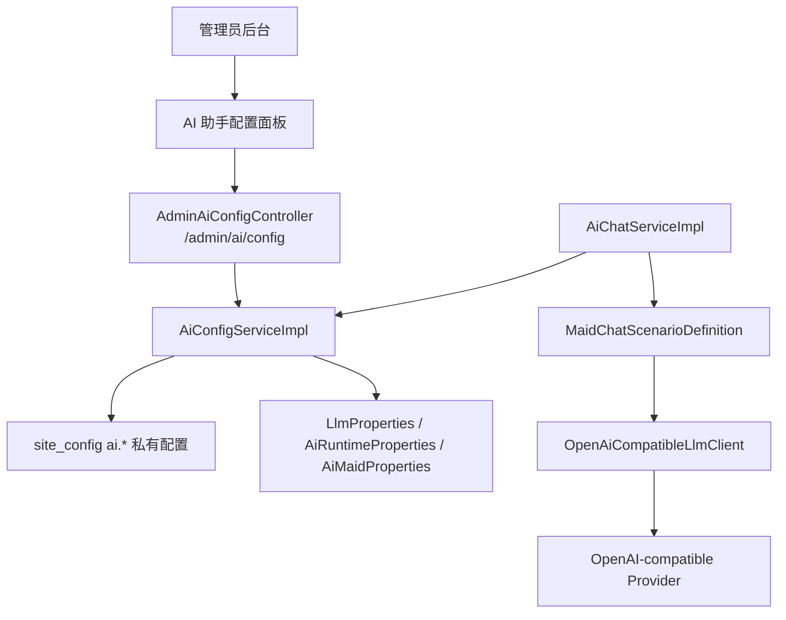

# AI 女仆后台配置设计

本文档描述当前已落地的 Lyra AI 后台配置能力。最后同步时间：2026-05-25。

## 1. 背景

Chen404 已具备基础 AI 能力：文章 AI 辅助、Lyra 女仆聊天、站内文章知识切片、会话持久化和 SSE 流式输出。早期配置主要来自 `application.yml`、环境变量和 classpath prompt 模板，适合部署时配置，不适合日常调试 Lyra 的模型、人设、检索策略和小气泡表现。

因此当前已经新增后台 AI 配置中心，让管理员可以在不重启服务的情况下调整：

- 模型连接参数。
- API Key。
- Lyra 人设和 prompt。
- 聊天、检索、引用、相关推荐、快捷建议策略。
- 聊天面板完整回答与 Live2D 小气泡短句的分层表现。

## 2. 当前目标与非目标

### 已实现目标

1. 管理员可在后台调整 AI 模型调用参数。
2. API Key 可写入和更新，但查询接口不返回明文。
3. Lyra 名称、人设版本、system/helper/companion prompt 可后台维护。
4. 聊天策略可后台配置。
5. 后台可测试模型连接。
6. 运行时优先使用数据库配置，未配置时回退到应用配置。
7. 公共接口不暴露 AI 敏感配置。
8. 预留 `webSearchEnabled` 工具开关。

### 当前非目标

- 未实现完整 tool calling 闭环。
- 未实现真实联网搜索。
- 未实现多供应商密钥池。
- 未实现按用户、页面、场景的复杂模型策略。
- 未实现 prompt 多版本回滚和 A/B 测试。

## 3. 总体架构



配置解析规则：

```text
site_config ai.* 非空配置
  -> application.yml / profile / env 默认配置
```

敏感字段只在服务端使用，公共站点配置接口不会返回任何 `ai.*` 私有配置。

## 4. 后台配置范围

### 4.1 模型连接配置

| 字段 | 说明 |
| ---- | ---- |
| `enabled` | 是否启用 LLM |
| `baseUrl` | 模型服务地址 |
| `model` | 模型名称 |
| `apiStyle` | `chat-completions` 或 `responses` |
| `apiKey` | 新 API Key，查询时不返回明文 |
| `apiKeyConfigured` | 是否已配置 API Key |
| `apiKeyPreview` | 脱敏预览 |
| `temperature` | 输出随机性 |
| `maxTokens` | 最大输出 token |
| `timeoutSeconds` | 请求超时 |

API Key 规则：

- 查询时不返回明文 key。
- 保存时 `apiKey` 为空字符串或空值表示保留旧 key。
- 保存时 `apiKey` 非空表示替换旧 key。
- 响应只返回 `apiKeyConfigured` 和 `apiKeyPreview`。

### 4.2 Lyra 人设配置

| 字段 | 说明 |
| ---- | ---- |
| `name` | 女仆名称，默认 `Lyra` |
| `personaVersion` | 人设版本 |
| `systemPrompt` | 覆盖默认 system prompt |
| `helperPrompt` | 覆盖站内助手 prompt |
| `companionPrompt` | 覆盖陪伴聊天 prompt |

prompt 覆盖规则：

- 数据库为空时使用 `src/main/resources/prompts/ai/*.txt` 默认模板。
- 数据库有值时使用后台配置值。

### 4.3 聊天策略配置

| 字段 | 范围 | 说明 |
| ---- | ---- | ---- |
| `enabled` | boolean | 是否启用 Lyra 聊天 |
| `retrievalEnabled` | boolean | 是否启用站内检索 |
| `maxCitationCount` | `0 - 8` | 引用数量上限 |
| `maxContextMessages` | `1 - 20` | 注入 prompt 的历史消息数 |
| `maxArticleContentChars` | `500 - 12000` | 当前文章正文注入长度 |
| `maxArticleSummaryChars` | `80 - 1000` | 当前文章摘要注入长度 |
| `maxSuggestionCount` | `0 - 5` | 快捷建议数量，`0` 表示关闭建议 |
| `relatedArticleLimit` | `0 - 6` | 相关推荐数量 |
| `requireRecommendIntentForRelatedArticles` | boolean | 是否仅在明确推荐意图下返回相关文章 |
| `bubbleMaxChars` | `12 - 60` | 小气泡最大字符数 |
| `bubbleLongReplyText` | text | 长回答时的小气泡兜底短句 |

### 4.4 工具配置

| 字段 | 说明 |
| ---- | ---- |
| `webSearchEnabled` | 预留开关，当前不代表已接入真实联网搜索 |

## 5. 数据存储

第一阶段复用 `site_config` 表，所有 AI 配置使用 `ai.*` key，并设置 `is_public = 0`。

### 5.1 LLM keys

| Key | 默认值 |
| ---- | ---- |
| `ai.llm.enabled` | `false` |
| `ai.llm.base_url` | `https://api.openai.com/v1` |
| `ai.llm.model` | `gpt-5.4-mini` |
| `ai.llm.api_style` | `chat-completions` |
| `ai.llm.api_key` | 空 |
| `ai.llm.temperature` | `0.2` |
| `ai.llm.max_tokens` | `512` |
| `ai.llm.timeout_seconds` | `30` |

### 5.2 Lyra keys

| Key | 默认值 |
| ---- | ---- |
| `ai.maid.name` | `Lyra` |
| `ai.maid.persona_version` | `v1.1` |
| `ai.maid.system_prompt` | 空，回退 classpath prompt |
| `ai.maid.helper_prompt` | 空，回退 classpath prompt |
| `ai.maid.companion_prompt` | 空，回退 classpath prompt |

### 5.3 Chat keys

| Key | 默认值 |
| ---- | ---- |
| `ai.chat.enabled` | `true` |
| `ai.chat.retrieval_enabled` | `true` |
| `ai.chat.max_citation_count` | `3` |
| `ai.chat.max_context_messages` | `8` |
| `ai.chat.max_article_content_chars` | `3000` |
| `ai.chat.max_article_summary_chars` | `300` |
| `ai.chat.max_suggestion_count` | `3` |
| `ai.chat.related_article_limit` | `2` |
| `ai.chat.require_recommend_intent_for_related_articles` | `true` |
| `ai.chat.bubble_max_chars` | `36` |
| `ai.chat.bubble_long_reply_text` | `我整理好了，打开聊天框看详细内容吧。` |

### 5.4 Tool keys

| Key | 默认值 |
| ---- | ---- |
| `ai.tools.web_search_enabled` | `false` |

## 6. 后端接口

所有接口均为 admin-only。

### 获取配置

```http
GET /api/admin/ai/config
```

返回 `AiAdminConfigDTO`，不包含明文 API Key。

### 更新配置

```http
PUT /api/admin/ai/config
```

请求体为 `AiAdminConfigDTO`。

保存规则：

- 数值字段做范围裁剪。
- 枚举字段做白名单校验。
- 文本字段 trim。
- API Key 空值保留旧值。
- 所有 AI 配置写入 `site_config`，并保持 `is_public = 0`。

### 测试连接

```http
POST /api/admin/ai/config/test-connection
```

请求示例：

```json
{
  "message": "请用一句话介绍你自己。",
  "useUnsavedConfig": true,
  "config": {}
}
```

响应示例：

```json
{
  "success": true,
  "message": "连接成功",
  "sampleText": "你好，我是 Lyra。",
  "traceId": "trace_ai_config_xxx",
  "latencyMs": 1234
}
```

`useUnsavedConfig = true` 时，允许使用当前表单尚未保存的配置测试连接。

## 7. 前端后台页面

入口：

```text
后台管理 -> 站点配置 -> AI 助手
```

主要文件：

```text
Chen404Fro/src/views/Admin/AdminSiteSettings.vue
Chen404Fro/src/views/Admin/components/AiAssistantSettings.vue
Chen404Fro/src/api/ai-admin.ts
Chen404Fro/src/types/index.ts
```

页面分区：

- 模型调用。
- 女仆人设。
- 聊天与检索。
- 小气泡。

主要交互：

- 重新加载配置。
- 测试连接。
- 保存 AI 配置。
- API Key 密码输入，留空表示保留已保存 key。

## 8. Lyra 回答显示分层

后端响应字段：

```java
private String panelAnswer;
private String bubbleText;
private String replyText;
```

兼容策略：

- 新前端优先使用 `panelAnswer` 和 `bubbleText`。
- `replyText` 暂时等于 `panelAnswer`，兼容旧前端。

显示规则：

- `panelAnswer` 用于聊天面板完整回答，不再被 180 字截断。
- `bubbleText` 用于 Live2D 旁短气泡。
- 长回答小气泡使用 `bubbleLongReplyText`。
- 面板打开时小气泡隐藏。
- 流式回复时小气泡不持续展示完整 delta。

## 9. 安全设计

- 所有 AI 配置接口必须管理员访问。
- 公共 `/site/config` 不返回 AI 配置。
- API Key 不在响应体中返回明文。
- API Key 不应在日志中输出。
- 前端状态不长期保存明文 API Key。
- 当前 API Key 存在 `site_config` 中，后续可升级为服务端加密存储。

## 10. 测试策略

后端重点测试：

- 默认配置合成。
- 数据库配置覆盖。
- API Key 脱敏。
- API Key 空值保留旧值。
- API Key 新值替换旧值。
- 数值字段范围裁剪。
- admin controller 响应不包含明文 key。
- Lyra 聊天使用后台配置。
- 关闭检索时不调用 `ArticleKnowledgeService`。
- 引用、建议、相关推荐数量遵守后台配置。
- `panelAnswer` 和 `bubbleText` 正确返回。

前端验证：

```powershell
cd Chen404Fro
npm run build
```

后端验证：

```powershell
cd Chen404Bac
mvn "-Dtest=AiConfigServiceImplTest,AdminAiConfigControllerTest,MaidChatScenarioDefinitionTest,AiChatServiceImplTest,OpenAiCompatibleLlmClientTest" test
```

## 11. 后续风险与演进

当前设计的主要取舍：

- 复用 `site_config` 可以减少表结构复杂度，但 AI 私有配置必须严格保持 `is_public = 0`。
- prompt 后台可编辑提高调试效率，也增加误配置风险。
- API Key 当前未加密存储，后续建议引入服务端加密密钥。

后续建议：

1. 增加恢复默认 prompt。
2. 增加 prompt 版本记录。
3. 加密存储 API Key。
4. 增加 AI 调用审计和成本统计。
5. 接入真实 web search 工具。
