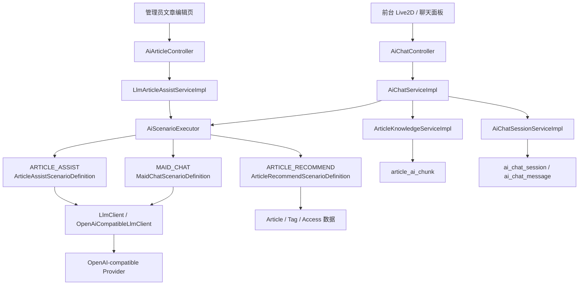
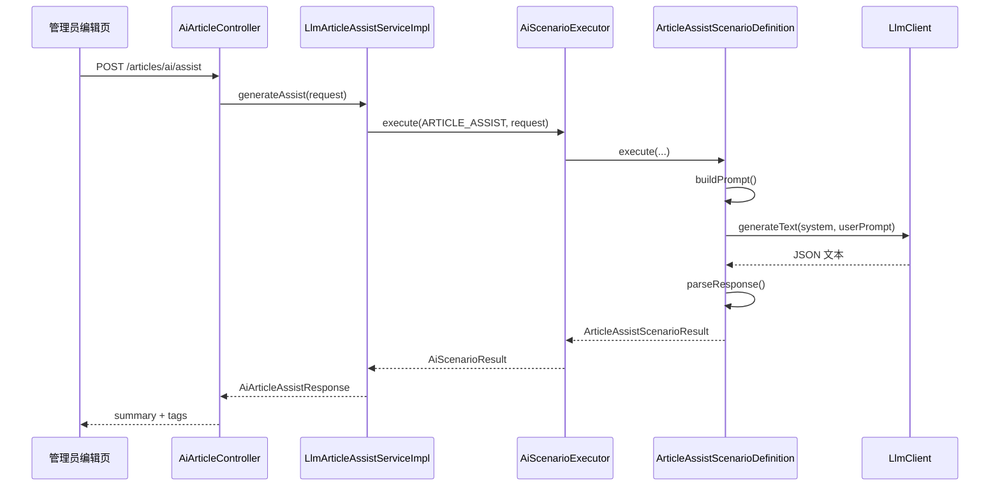
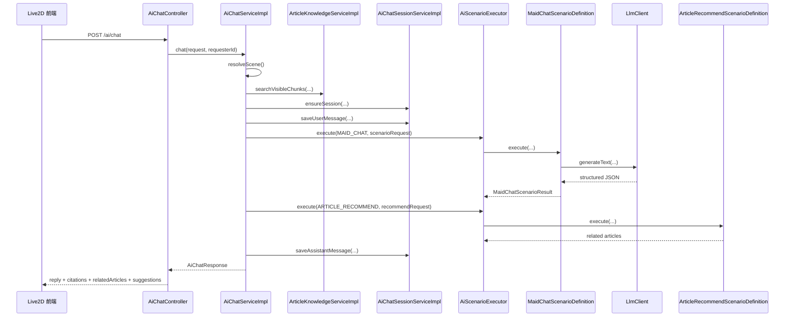
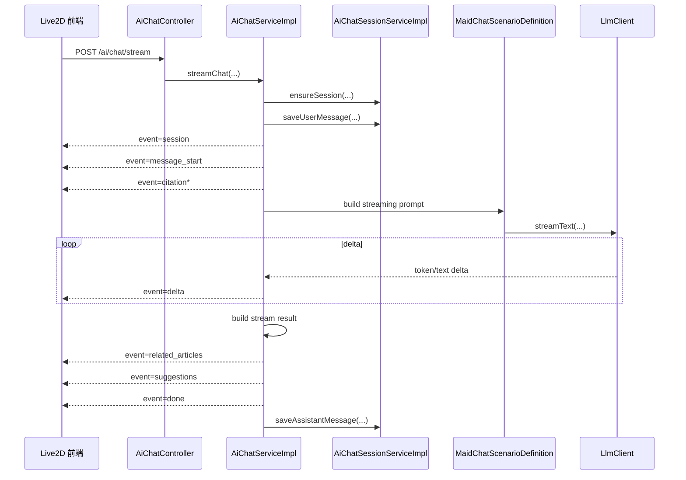
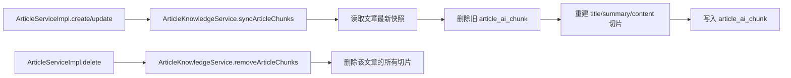

# Chen404 项目 AI 设计与接入文档

## 1. 文档目的

本文档用于完整说明 Chen404 当前已经落地的 AI 设计、接入方式、运行链路、数据结构、前后端协作方式，以及下一阶段的可演进方向。

这不是一份抽象的“未来设想”文档，而是一份基于当前代码实现整理出来的“现状设计说明 + 演进设计说明”。

当前文档覆盖的核心范围：

- 文章 AI 辅助能力
- Lyra 女仆聊天能力
- 场景化 AI 应用层
- 站内知识切片与轻量检索
- 会话持久化、SSE 流式输出与前端消费
- 相关推荐场景的统一能力接口

## 2. 当前 AI 能力总览

截至当前版本，项目已经接入 3 类 AI 相关能力：

| 能力 | 入口 | 当前状态 | 核心实现 |
| --- | --- | --- | --- |
| 文章摘要/标签生成 | `POST /articles/ai/assist` | 已上线 | LLM 场景执行 |
| Lyra 同步聊天 | `POST /ai/chat` | 已上线 | 场景执行 + 知识检索 + 会话持久化 |
| Lyra 流式聊天 | `POST /ai/chat/stream` | 已上线 | SSE + 流式模型输出 |
| 历史会话恢复 | `GET /ai/chat/sessions/{sessionId}` | 已上线 | 会话表 + 消息表恢复 |
| 相关推荐 | 聊天响应中的 `relatedArticles` | 已上线，规则版 V1 | `ARTICLE_RECOMMEND` 场景 |

当前方案的定位不是“全量 AI 平台”，而是：

1. 先统一大模型调用抽象
2. 再把现有业务能力沉淀为场景化 AI 应用层
3. 在聊天场景中接入站内知识召回、引用与相关推荐
4. 为后续推荐系统、RAG 升级、场景配置化治理预留统一入口

## 3. 设计目标

当前这版 AI 架构主要围绕 5 个设计目标展开：

1. 业务层不直接操作模型协议
2. prompt 设计与业务流程解耦
3. 当前场景要能快速落地，同时保持可扩展
4. 检索、引用、相关推荐要能逐步增强，而不是一次性做重
5. 前端能同时消费同步响应、流式事件和历史恢复结果

对应到实现上，核心策略是：

- 用 `LlmClient` 屏蔽上游协议差异
- 用 `AiScenarioExecutor` 统一 AI 场景入口
- 用 `ScenarioDefinition` 承载 prompt 构造与结果解析
- 用 `article_ai_chunk` 承载第一阶段轻量知识库
- 用 `ai_chat_session` / `ai_chat_message` 承载会话恢复和结果快照

## 4. 总体架构

### 4.1 分层总览



### 4.2 分层职责

#### 第一层：Controller 层

负责暴露 HTTP 能力入口，不承担 AI 细节。

对应实现：

- `com.chen404.controller.AiArticleController`
- `com.chen404.controller.AiChatController`

#### 第二层：业务编排层

负责参数校验、会话编排、知识召回、响应拼装，不直接关心模型协议。

对应实现：

- `com.chen404.service.impl.LlmArticleAssistServiceImpl`
- `com.chen404.service.impl.AiChatServiceImpl`

#### 第三层：AI Application Layer

这是当前新增的统一 AI 场景层，负责把“AI 能力”定义成标准化场景。

对应实现：

- `com.chen404.service.support.scenario.AiScenarioCode`
- `com.chen404.service.support.scenario.AiScenarioRequest`
- `com.chen404.service.support.scenario.AiScenarioResult`
- `com.chen404.service.support.scenario.AiScenarioDefinition`
- `com.chen404.service.support.scenario.AiScenarioExecutor`

#### 第四层：Provider Adapter

负责屏蔽不同上游模型接口协议差异。

对应实现：

- `com.chen404.service.support.LlmClient`
- `com.chen404.service.support.OpenAiCompatibleLlmClient`

## 5. 为什么要引入场景化 AI 应用层

在早期实现里，文章 AI 和聊天 AI 很容易各自演化出一套独立的：

- prompt 拼接逻辑
- LLM 请求构造逻辑
- JSON 解析逻辑
- fallback 逻辑

这样的问题有两个：

1. AI 能力会越来越像“业务内嵌代码”，难以复用
2. 后续新增推荐、RAG、审核、改写等能力时，会继续长出第三套、第四套接法

所以当前架构把接入抽成“场景”：

- `ARTICLE_ASSIST`
- `MAID_CHAT`
- `ARTICLE_RECOMMEND`

每个场景定义自己的：

- 输入对象
- 输出对象
- prompt 组装
- 解析策略
- fallback 策略

而业务层统一通过 `AiScenarioExecutor` 调用。

这样带来的直接收益是：

1. 业务层只关心业务输入输出
2. 模型接入方式一致
3. 新增 AI 能力时，开发路径统一
4. 后续做场景级配置治理时，有稳定挂点

## 6. 大模型接入层设计

### 6.1 统一配置

当前 LLM 配置位于 `application.yml`，由 `LlmProperties` 承载：

```yaml
llm:
  enabled: ${LLM_ENABLED:false}
  api-key: ${LLM_API_KEY:}
  base-url: ${LLM_BASE_URL:https://api.openai.com/v1}
  model: ${LLM_MODEL:gpt-5.4-mini}
  api-style: ${LLM_API_STYLE:chat-completions}
  chat-completions-path: ${LLM_CHAT_COMPLETIONS_PATH:/chat/completions}
  responses-path: ${LLM_RESPONSES_PATH:/responses}
  temperature: ${LLM_TEMPERATURE:0.2}
  max-tokens: ${LLM_MAX_TOKENS:512}
  timeout-seconds: ${LLM_TIMEOUT_SECONDS:30}
```

当前配置设计有几个特点：

1. 默认按 OpenAI-compatible 协议设计
2. 支持 `chat/completions` 与 `responses` 两种风格
3. 支持通过环境变量切换供应商、模型、路径和超时
4. 业务层不感知具体 Provider

### 6.2 Provider Adapter 职责

`OpenAiCompatibleLlmClient` 当前承担以下职责：

- 校验 `LLM_ENABLED`、`LLM_API_KEY`、`LLM_MODEL`
- 构造同步文本请求
- 构造流式文本请求
- 屏蔽 `chat/completions` 与 `responses` 的字段差异
- 提取纯文本输出
- 统一处理 HTTP 错误、空响应、网络异常

### 6.3 为什么不让业务层直接发 HTTP

因为如果让 `AiChatServiceImpl` 或 `LlmArticleAssistServiceImpl` 直接写 HTTP 请求：

- 模型协议会散落到业务代码里
- 切换厂商成本高
- 测试需要重复 mock HTTP 结构
- 未来增加重试、审计、限流时缺少统一入口

当前通过 `LlmClient` 把模型调用降维成：

- 给 system prompt
- 给 user prompt
- 返回纯文本

这是一个非常适合当前阶段的抽象粒度。

## 7. Prompt 体系设计

### 7.1 Prompt 模板模块化

当前 Lyra 的 prompt 并没有硬编码在聊天服务里，而是拆成了三类模板：

- `prompts/ai/maid-system-prompt.txt`
- `prompts/ai/maid-helper-task-prompt.txt`
- `prompts/ai/maid-companion-task-prompt.txt`

对应加载与组装逻辑：

- `AiPromptTemplateLoader`
- `AiMaidPromptBuilder`
- `AiMaidProperties`

### 7.2 Runtime Context 注入

系统 prompt 在运行时会额外拼入上下文边界，例如：

- `scene`
- `maidName`
- `personaVersion`
- `pageContext`
- `currentArticleId`
- `currentArticleTitle`
- `citationsRequired`
- `allowCasualConversation`

这意味着：

1. 人设文案可配置
2. 场景任务文案可配置
3. 运行时边界由后端注入，减少模型脑补

### 7.3 Prompt 体系的价值

这套设计把 prompt 分成三层：

1. 角色层
2. 任务层
3. 运行时上下文层

这种拆法非常适合后续继续扩展：

- 新增评论引导场景
- 新增总结场景
- 新增推荐解释场景
- 新增改写、审核场景

都不需要重写整个聊天服务。

## 8. 场景设计详解

### 8.1 `ARTICLE_ASSIST`：文章摘要与标签生成

#### 入口

- `POST /articles/ai/assist`

#### 目标

用于管理员在文章编辑页生成：

- 中文摘要
- 标签建议

#### 实现职责分布

- `AiArticleController`：HTTP 入口
- `LlmArticleAssistServiceImpl`：业务编排
- `ArticleAssistScenarioDefinition`：prompt 与输出解析
- `LlmClient`：模型调用

#### 设计要点

1. 只允许管理员调用
2. prompt 明确要求输出合法 JSON
3. 摘要长度有限制
4. 标签数量和顺序有要求
5. 支持“重新生成但避开当前结果”

#### 流程图



#### 为什么单独做成场景

因为这个能力虽然简单，但天然是一个独立 AI 应用单元：

- 输入结构稳定
- 输出结构稳定
- prompt 约束明确
- 容易单测

这正适合沉淀为独立 `ScenarioDefinition`。

### 8.2 `MAID_CHAT`：Lyra 聊天场景

#### 入口

- `POST /ai/chat`
- `POST /ai/chat/stream`
- `GET /ai/chat/sessions/{sessionId}`

#### 场景目标

Lyra 聊天不是纯闲聊，它实际上融合了两类场景：

- `HELPER`：页面/文章助手
- `COMPANION`：陪伴聊天

#### 场景识别

当前识别规则在 `AiChatServiceImpl.resolveScene(...)` 中完成，主要依据：

1. 用户最新消息关键词
2. 页面上下文 `pageContext`
3. 当前是否位于文章页

这是一个轻规则版本的场景识别，优点是简单可控，缺点是复杂语义下仍可能误判。

#### 职责边界

`AiChatServiceImpl` 当前负责：

- 请求校验
- 场景识别
- 当前文章加载
- 知识检索
- 会话创建与消息保存
- 响应拼装
- SSE 事件发送

`MaidChatScenarioDefinition` 当前负责：

- structured prompt 组装
- streaming prompt 组装
- JSON 结构化输出解析
- fallback 回复生成
- 默认建议语生成

#### 同步聊天流程图



#### 流式聊天流程图



#### 返回结构为什么拆成多块

聊天结果被拆成：

- `replyText`
- `citations`
- `relatedArticles`
- `suggestions`

这是刻意设计的。因为前端展示不是单一气泡：

1. 短回复可用于气泡和对话流
2. 引用适合展示“证据卡片”
3. 相关推荐适合展示“继续阅读入口”
4. 建议语适合展示快捷追问

这种结构比单段大文本更适合产品化演进。

### 8.3 `ARTICLE_RECOMMEND`：相关推荐场景

#### 当前定位

这个场景当前不是“让模型直接生成文章推荐列表”，而是一个规则版推荐能力，主要用于：

- 在 `HELPER` 场景里为聊天附带相关推荐
- 统一推荐能力接口，为后续升级预留入口

#### 当前输入

`ArticleRecommendScenarioRequest` 主要包含：

- `currentArticleId`
- `pageContext`
- `requesterId`
- `seedText`
- `limit`

#### 当前输出

`ArticleRecommendScenarioResult` 主要包含：

- `items`
- `reason`
- `traceId`
- `sourceType`

#### 当前召回与打分逻辑

当前实现位于 `ArticleRecommendScenarioDefinition`，是规则版 V1：

1. 候选集：最近公开文章 + 站点推荐文章优先
2. 过滤：排除当前文章，只返回当前访问者可见的文章
3. 打分：
   - 同分类 `+40`
   - 每个共享标签 `+25`
   - 管理员推荐文章 `+15`
   - `seedText` 关键词匹配加分
4. 返回 Top N

#### 为什么推荐先不用 LLM 直出

原因是推荐和聊天不一样：

1. 推荐需要可控性
2. 推荐需要稳定排序
3. 推荐需要可见性过滤
4. 推荐需要后续可评估

因此当前采取“先规则召回、后续可加 AI rerank”的路线更稳。

## 9. 站内知识检索设计

### 9.1 为什么先做 MySQL 切片库

当前没有一开始就接入向量数据库，而是先把文章知识切成 `article_ai_chunk`：

- 成本低
- 同步简单
- 直接复用现有 MySQL
- 能快速验证产品价值

这符合第一阶段目标：先解决“站内可回答、可引用、可恢复”。

### 9.2 切片结构

`article_ai_chunk` 中保存三类切片：

- `title`
- `summary`
- `content`

`content` 切片采用：

- chunk size：`360`
- overlap size：`80`

### 9.3 切片同步机制

文章知识切片不是离线批处理，而是直接跟文章生命周期绑定。

在 `ArticleServiceImpl` 中：

- 创建文章后：`syncArticleChunks(articleId)`
- 更新文章后：`syncArticleChunks(articleId)`
- 删除文章后：`removeArticleChunks(articleId)`

#### 生命周期流程图



### 9.4 当前检索方式

`ArticleKnowledgeServiceImpl.searchVisibleChunks(...)` 当前流程：

1. 优先搜索当前文章切片
2. 从用户 query 中提取关键词
3. 用 MySQL `LIKE` 搜标题和切片正文
4. 按规则重打分
5. 根据访问权限过滤不可见文章
6. 返回带分数和引用片段的命中结果

### 9.5 当前优缺点

优点：

- 简单稳定
- 成本低
- 权限过滤容易做
- 与站内文章生命周期天然一致

缺点：

- 语义检索能力弱
- 文本规模增大后性能会下降
- 对同义词、隐式问题支持有限

因此它是一个非常典型的“第一阶段可用型 RAG 雏形”。

## 10. 会话持久化与历史恢复设计

### 10.1 数据表

当前 AI 会话持久化依赖三张表：

| 表名 | 作用 |
| --- | --- |
| `ai_chat_session` | 记录会话归属、来源页面、来源文章、最近消息时间 |
| `ai_chat_message` | 记录 user/assistant 消息正文与结果快照 |
| `article_ai_chunk` | 记录站内知识切片 |

### 10.2 消息快照内容

`ai_chat_message` 对 assistant 消息会额外保存：

- `citations_json`
- `related_articles_json`
- `suggestions_json`
- `trace_id`

这样做的意义是：

1. 历史恢复不必重新请求模型
2. 历史恢复时能保持当时的引用与推荐结果
3. 会话记录是“完整产品结果快照”，不是只存纯文本

### 10.3 归属校验

会话支持两类身份：

- 登录用户：`user_id`
- 游客：`visitor_id`

`AiChatSessionServiceImpl` 会在读取或续用会话时校验归属，避免串会话。

## 11. SSE 流式协议设计

当前流式聊天采用标准 SSE，事件类型包括：

- `session`
- `message_start`
- `delta`
- `citation`
- `related_articles`
- `suggestions`
- `done`
- `error`

这种协议的特点是：

1. 前端可以边收边展示
2. 引用、相关推荐、建议语不必强耦合在首包里
3. 出错时仍可发送 fallback 内容和错误提示

前端在 `Chen404Fro/src/api/ai.ts` 中定义事件类型，在 `Live2D.vue` 中消费这些事件。

## 12. 前后端接入协作方式

### 12.1 文章 AI 辅助

前端编辑页发送：

- 标题
- 正文
- 是否重新生成
- 当前摘要/标签

后端返回：

- `summary`
- `tags`

### 12.2 Lyra 聊天

前端发送：

- `sessionId`
- `visitorId`
- 最近几轮 `messages`
- `pageContext`
- `currentArticleId`
- `stream`

后端返回：

- `replyText`
- `citations`
- `relatedArticles`
- `suggestions`
- `traceId`

### 12.3 前端展示策略

Live2D 面板当前已经消费：

- 同步聊天响应
- SSE 流式事件
- 历史会话恢复

并将 `relatedArticles` 展示为继续阅读卡片。

这说明 AI 接入已经不只是“接口打通”，而是完整接入到了实际交互产品里。

## 13. 容错、降级与边界控制

### 13.1 当前降级策略

当前系统已经具备几个关键的降级点：

1. LLM 返回非 JSON 时，聊天走 fallback 回复
2. 当前文章上下文读取失败时，跳过 article context
3. 推荐场景执行失败时，跳过 `relatedArticles`
4. 流式聊天失败时，发送 fallback 内容并补 error 事件

### 13.2 当前边界

当前系统已经比较稳，但仍然有明确边界：

1. 模型配置还是全局级，尚未做到场景级配置
2. 检索还不是向量化或混合检索
3. 场景识别是轻规则，不是语义路由
4. 相关推荐是规则版，不是完整推荐系统
5. 还没有成本统计、限流、配额和审计看板

## 14. 可观测性与测试设计

### 14.1 当前日志

系统已经埋入若干关键日志点，例如：

- `LLM_TEXT_REQ`
- `LLM_TEXT_OK`
- `LLM_TEXT_FAIL`
- `AI_CHAT_REQ`
- `AI_CHAT_OK`
- `AI_CHAT_PARSE_FAIL`
- `AI_CHAT_RECOMMEND_SKIP`

这使得当前至少具备：

- 基础调用排查
- 返回异常定位
- 流程追踪

### 14.2 当前测试覆盖重点

当前已补充的重点测试包括：

- `AiScenarioExecutorTest`
- `ArticleAssistScenarioDefinitionTest`
- `LlmArticleAssistServiceImplTest`
- `MaidChatScenarioDefinitionTest`
- `AiChatServiceImplTest`
- `AiChatSessionServiceImplTest`
- `ArticleRecommendScenarioDefinitionTest`

测试重点主要覆盖：

1. 场景执行分发
2. prompt/输出解析
3. fallback 行为
4. 推荐规则结果
5. 会话恢复中的 `relatedArticles`

## 15. 当前方案的优点

从工程视角看，这套方案的优点比较明确：

1. 已经从“散装 AI 调用”升级为“统一 AI 场景层”
2. 聊天、摘要、推荐三类能力有统一接法
3. 前后端链路完整，产品可感知
4. 数据结构设计为后续增强保留了位置
5. 规则版知识检索和推荐足够轻，适合当前阶段

## 16. 下一阶段推荐演进路线

如果继续推进，我建议按下面顺序升级：

### 阶段一：场景级配置治理

目标：

- 每个场景独立配置模型、温度、超时、maxTokens、fallback 策略

建议新增：

- `AiScenarioProperties`
- `scenario -> provider/model` 映射配置
- 场景级调用日志统计

### 阶段二：RAG 升级为混合检索

目标：

- 从 `LIKE` 检索升级为 `关键词召回 + 向量召回 + rerank`

建议路径：

1. 保留当前 `article_ai_chunk`
2. 为切片增加 embedding 存储
3. 增加向量索引或外部向量库
4. 最终做混合召回 + 引用回填

### 阶段三：推荐能力独立服务化

目标：

- 不只在聊天里给相关推荐，而是形成独立推荐能力

建议拆分为：

1. 候选召回
2. 权限过滤
3. 打分排序
4. AI rerank 或推荐理由生成

### 阶段四：平台治理能力

目标：

- 让 AI 不只是能用，还能被管理

建议补齐：

- 限流
- 成本统计
- 审计日志
- Prompt 版本管理
- 回放评估
- A/B 策略

## 17. 结论

Chen404 当前的 AI 设计，已经从“简单调一下大模型”进化成了一套比较清晰的应用级架构：

1. 底层有统一的 OpenAI-compatible Provider Adapter
2. 中间有场景化 AI 应用层
3. 上层有文章辅助、聊天、相关推荐三个真实业务能力
4. 周边有知识切片、会话持久化、SSE 流式输出和前端消费闭环

这套方案的最大价值，不在于“已经做成了一个完整 AI 平台”，而在于：

它已经把后续平台化、RAG 化、推荐系统化所需要的边界，提前长在了正确的位置上。

换句话说，当前这版设计最重要的成果是：

AI 在项目里已经不再是一个孤立接口，而是一个能够持续演进的应用能力层。

## 18. 关键代码定位

为了方便后续评审和继续开发，下面列出当前核心文件：

### Controller

- `Chen404Bac/src/main/java/com/chen404/controller/AiArticleController.java`
- `Chen404Bac/src/main/java/com/chen404/controller/AiChatController.java`

### 场景执行层

- `Chen404Bac/src/main/java/com/chen404/service/support/scenario/AiScenarioCode.java`
- `Chen404Bac/src/main/java/com/chen404/service/support/scenario/AiScenarioRequest.java`
- `Chen404Bac/src/main/java/com/chen404/service/support/scenario/AiScenarioResult.java`
- `Chen404Bac/src/main/java/com/chen404/service/support/scenario/AiScenarioDefinition.java`
- `Chen404Bac/src/main/java/com/chen404/service/support/scenario/AiScenarioExecutor.java`

### 场景定义

- `Chen404Bac/src/main/java/com/chen404/service/support/scenario/article/ArticleAssistScenarioDefinition.java`
- `Chen404Bac/src/main/java/com/chen404/service/support/scenario/chat/MaidChatScenarioDefinition.java`
- `Chen404Bac/src/main/java/com/chen404/service/support/scenario/recommend/ArticleRecommendScenarioDefinition.java`

### 业务编排层

- `Chen404Bac/src/main/java/com/chen404/service/impl/LlmArticleAssistServiceImpl.java`
- `Chen404Bac/src/main/java/com/chen404/service/impl/AiChatServiceImpl.java`
- `Chen404Bac/src/main/java/com/chen404/service/impl/AiChatSessionServiceImpl.java`
- `Chen404Bac/src/main/java/com/chen404/service/impl/ArticleKnowledgeServiceImpl.java`

### Prompt 与配置

- `Chen404Bac/src/main/java/com/chen404/service/support/prompt/AiMaidPromptBuilder.java`
- `Chen404Bac/src/main/java/com/chen404/service/support/prompt/AiPromptTemplateLoader.java`
- `Chen404Bac/src/main/java/com/chen404/config/LlmProperties.java`
- `Chen404Bac/src/main/java/com/chen404/config/AiMaidProperties.java`
- `Chen404Bac/src/main/resources/application.yml`
- `Chen404Bac/src/main/resources/prompts/ai/`

### 数据结构

- `Chen404Bac/src/main/resources/db/migration/V2026051001__ai_chat_and_article_chunk.sql`

### 前端接入

- `Chen404Fro/src/api/ai.ts`
- `Chen404Fro/src/components/Live2D/Live2D.vue`
- `Chen404Fro/src/components/Live2D/Live2DChatPanel.vue`
- `Chen404Fro/src/types/index.ts`
