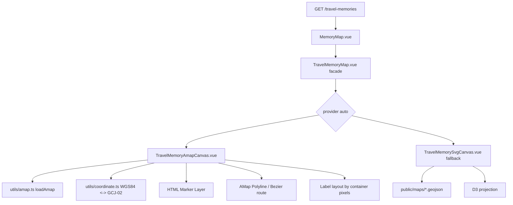

# 旅行纪念地图设计与改造方案

本文档合并原《旅行纪念地图功能方案》和《旅行纪念地图改造推进计划》，统一维护旅行纪念地图的当前实现、前后端边界、已完成收敛和后续可继续推进的事项。

最近一次按代码校准时间：2026-06-09。

## 1. 当前结论

- 旅行纪念地图已经不是纯规划功能，而是当前前后端均已落地的正式模块。
- 当前主入口是前端 `/memory-map`，以“双页地图册 + 地点详情 + 胶片列表”的方式呈现。
- 模块访问权限不是完全公开，而是要求“管理员或知友”。
- 前端已接入市级 GeoJSON、本地 SVG 回退、高德编辑态能力、独立详情页和后台工作台；展示态仍以 SVG/D3 投影为主，后续优先迁移为高德真实底图展示态。
- 后端已接入地点与照片维护、图片 EXIF 解析、文件转永久、统一引用同步。

因此，后续文档不再拆成“功能方案”和“推进计划”两篇分别维护，而采用一篇现行设计文档统一维护。

## 2. 功能定位

旅行纪念地图当前承担三类职责：

1. 展示受限可见的旅行地点与照片故事
2. 作为管理员可维护的旅行内容工作台
3. 提供照片、地点、时间、坐标之间的统一数据结构

它既不是简单的“地图打点”，也不是传统后台表格，而是内容展示页与后台录入流混合的一类专题功能。

## 3. 当前真实实现

## 3.1 前端页面

当前页面与入口：

| 路径 | 角色 | 权限 |
| --- | --- | --- |
| `/memory-map` | 主展示页 | 管理员或知友 |
| `/memory-map/detail/:id` | 独立详情页 | 管理员或知友 |
| `/memory-map/create` | 创建工作台 | 管理员 |
| `/memory-map/edit/:id` | 编辑工作台 | 管理员 |

页面文件：

- `src/views/MemoryMap/MemoryMap.vue`
- `src/views/MemoryMap/TravelMemoryDetail.vue`
- `src/views/MemoryMap/TravelMemoryCreate.vue`

## 3.2 主展示页结构

`MemoryMap.vue` 当前不是单一地图板，而是三段组合：

1. 左页：地图主视觉、当前位置、地图操作与管理员新增入口
2. 右页：当前地点的册页式详情、封面图、旅行碎片、引用语
3. 下方：旅行胶片网格，支持点击切换地点、加载更多、管理员编辑/删除

当前交互特征：

- 无权限用户先看到 `FeatureAccessCover`
- 有权限用户进入地图与地点内容
- 管理员在同一页面可直接跳转新建/编辑

## 3.3 独立详情页

`TravelMemoryDetail.vue` 当前提供：

- 返回地图入口
- 大图轮播和缩略图切换
- 封面标记
- 旅行整体感想
- 当前照片图说
- 更多照片横向胶片带

它适合承接“从地图卡片进入、更专注地看某一段旅程”的场景。

## 3.4 创建/编辑工作台

`TravelMemoryCreate.vue` 当前支持：

- 地图点选坐标
- 地点搜索
- 自动定位
- 已有地点快速切换
- 多图上传
- 图片备注、感想、拍摄时间、排序
- 封面图标记
- 到访时间与展示状态配置

编辑页已经不是传统后台表单，而是专题工作台。

## 3.5 地图组件当前实现

核心组件：

- `src/components/TravelMemoryMap/TravelMemoryMap.vue`
- `src/components/TravelMemoryManager/TravelMemoryManager.vue`

当前地图能力：

- 优先加载 `public/maps/china-city.manifest.json` 指向的城市级 GeoJSON 数据
- 可同时加载省级 GeoJSON 作为投影与边界层
- 若数据加载失败，回退到基础 SVG 地图
- 编辑态支持高德地图脚本接入、定位和逆地理编码
- 支持边界点击、城市匹配、点位高亮、标签避让

对应辅助工具：

- `src/utils/mapData.ts`
- `src/utils/amap.ts`
- `src/utils/cityName.ts`

## 3.6 后端接口

公开受限接口：

- `GET /travel-memories`
- `GET /travel-memories/{id}`

管理员接口：

- `GET /admin/travel-memories`
- `GET /admin/travel-memories/{id}`
- `POST /admin/travel-memories`
- `PUT /admin/travel-memories/{id}`
- `DELETE /admin/travel-memories/{id}`

相关控制器与服务：

- `TravelMemoryController`
- `TravelMemoryServiceImpl`
- `TravelMemoryConverter`

## 3.7 图片上传与 EXIF

旅行图片上传入口：

- `POST /upload/travel-memory-image`

当前链路：

1. 前端上传图片
2. 后端写入临时文件
3. `TravelMemoryImageMetadataServiceImpl` 尝试解析 EXIF
4. 返回图片 URL、拍摄时间、可用坐标
5. 前端在编辑表单中回填照片与地点信息
6. 保存地点时统一转永久并同步文件引用

这意味着“图片上传”与“地点保存”是分两步完成的。

## 3.8 数据模型

后端主实体：

- `TravelMemoryLocation`
- `TravelMemoryEntry`

前端主类型：

- `TravelMemoryLocationListItem`
- `TravelMemoryLocationDetail`
- `TravelMemoryEntry`
- `CreateTravelMemoryCommand`
- `UpdateTravelMemoryCommand`

结构要点：

- 地点拥有标题、省份、城市、坐标、摘要、到访时间范围、展示状态、排序
- 一个地点包含多张照片条目
- 照片条目可保存备注、感想、拍摄时间、展示顺序、是否封面、坐标来源

## 3.9 权限模型

可见性：

- 管理员：可查看、可管理
- 知友：可查看
- 普通登录用户与游客：不可查看内容，只能看到访问封面

后端最终权限判断由 `AccessService` 完成，前端 `requiresFriend` 只是体验层拦截。

## 4. 已完成的改造收敛

以下内容已经完成，不再作为未来计划单独维护：

### 4.1 地图展示从基础 SVG 扩展到市级 GeoJSON

- 已支持城市级边界加载
- 已支持省级边界层
- 已保留 SVG 回退方案

### 4.2 编辑态地图能力增强

- 已支持地图点选
- 已支持地点搜索
- 已支持自动定位
- 已支持高德地图脚本接入

### 4.3 数据结构收敛

- 地点与照片拆分为稳定的 location / entry 模型
- 保存时统一同步文件引用
- 图片上传链路与 EXIF 解析已贯通

### 4.4 展示态体验升级

- 已有主展示页
- 已有独立详情页
- 已有管理员工作台

## 5. 当前前后端边界

### 前端负责

- 地图展示与交互
- 点位切换与页面状态
- 高德能力接入
- 图片上传后的编辑表单组织
- 受限访问封面展示

### 后端负责

- 地点与照片持久化
- 权限校验
- EXIF 解析
- 文件转永久
- 文件引用同步
- 删除后清理与历史文件治理

## 6. 高德展示态改造方案

本章节描述下一阶段地图展示层改造：将 `/memory-map` 主展示页从“SVG/D3 投影承载经纬度”迁移为“高德地图承载真实坐标，自定义 HTML 标签承载 Chen404 视觉表达”。目标是优先解决点位定位不准确，同时保留当前旅行手账式标签、路线和地点切换体验。

### 6.1 背景与问题

当前 `TravelMemoryMap.vue` 存在两套地图能力：

| 场景 | 当前实现 | 主要用途 |
| --- | --- | --- |
| 展示态 | 城市级 GeoJSON + D3 `geoMercator` + SVG marker | `/memory-map` 主展示页 |
| 编辑态 | 高德 JS API 2.0 + Marker + Geocoder | 创建/编辑页选点、搜索、逆地理编码 |

展示态不准确的主要原因不是地点数据本身不可用，而是展示层与真实地图引擎之间存在天然偏差：

1. SVG/D3 投影只适合表达“地图插画”和“行政区概览”，不适合承接景点级或街道级坐标。
2. 当前市级 GeoJSON 来源、投影范围、SVG viewBox 和视觉修正参数共同影响点位，任何一个环节偏差都会被用户感知为“点不在真实位置”。
3. 高德地图使用 GCJ-02 坐标体系，系统持久化和 EXIF 来源更适合保存 WGS84，展示态如果不经过同一套转换链路，会出现中国大陆范围内的系统性偏移。
4. 当前展示态的标签避让、边界点击和路线绘制都绑定在 SVG 坐标系上，导致后续继续微调的收益有限。

### 6.2 改造结论

推荐采用以下方案：

1. `/memory-map` 展示态默认使用高德 JS API 2.0 初始化真实地图。
2. 点位使用 `AMap.Marker` 的自定义 `content` 渲染 HTML marker，保留当前樱花 pin、标签气泡、active 高亮和点击交互。
3. 标签避让继续由前端自研布局算法负责，但输入坐标从 D3 投影点改为高德地图容器像素坐标。
4. 现有 SVG/GeoJSON 地图保留为 fallback，用于未配置 `VITE_AMAP_KEY`、高德脚本加载失败、网络异常或未来的离线预览。
5. 第一阶段不要求后端改表，继续以 WGS84 坐标作为服务端数据契约。

### 6.3 目标与非目标

| 类型 | 内容 |
| --- | --- |
| 目标 | 真实地图底图承载坐标，解决展示态定位偏差 |
| 目标 | 保留当前标签文字、active 状态、点击选择、同城多地点选择卡片 |
| 目标 | 复用已有 `loadAmap`、`wgs84ToGcj02`、`gcj02ToWgs84` 和编辑态高德接入 |
| 目标 | 保留 Chen404 “Sakura Memory Journal” 的纸感、温暖、旅行手账氛围 |
| 目标 | 在高德不可用时自动降级到当前 SVG/GeoJSON 展示态 |
| 非目标 | 第一阶段不重做旅行内容数据模型 |
| 非目标 | 第一阶段不引入 MapLibre、Leaflet、Mapbox 等第二地图供应商 |
| 非目标 | 第一阶段不实现全球旅行地图，境外坐标仅按当前转换工具的 out-of-China 分支自然展示 |
| 非目标 | 不把地图页改成普通工具型地图，视觉上仍需属于 Chen404 的记忆册页 |

### 6.4 总体架构



改造后，`TravelMemoryMap.vue` 应尽量成为稳定门面组件，继续对外暴露当前 props 和 emits：

- `locations`
- `activeId`
- `pickerMode`
- `pickerLatitude`
- `pickerLongitude`
- `searchKeyword`
- `searchRequest`
- `select`
- `pick`
- `search-error`

展示态由新组件承接，高德不可用时回落到现有 SVG 组件。编辑态可继续复用现有高德选点逻辑，后续再决定是否与展示态共用底层 composable。

### 6.5 前端模块拆分建议

建议拆成以下边界，避免继续扩大单文件复杂度：

| 模块 | 建议位置 | 职责 |
| --- | --- | --- |
| 地图门面 | `src/components/TravelMemoryMap/TravelMemoryMap.vue` | 判断展示态/编辑态/fallback，保持外部 API 稳定 |
| 高德展示态 | `src/components/TravelMemoryMap/TravelMemoryAmapCanvas.vue` | 初始化高德地图、管理底图、marker、路线、地图事件 |
| SVG fallback | `src/components/TravelMemoryMap/TravelMemorySvgCanvas.vue` | 承接现有 SVG/D3 展示逻辑 |
| 高德生命周期 | `src/components/TravelMemoryMap/composables/useAmapMemoryMap.ts` | 加载、销毁、fitView、zoom、resize、事件解绑 |
| marker 管理 | `src/components/TravelMemoryMap/composables/useTravelMapMarkers.ts` | 创建、更新、删除 HTML marker，处理 active 与 click |
| 标签布局 | `src/components/TravelMemoryMap/composables/useTravelMapLabelLayout.ts` | 基于容器像素计算 label 方位、避让、连接线 |
| 路线层 | `src/components/TravelMemoryMap/composables/useTravelMapRoute.ts` | 按访问时间生成路线，更新 AMap 覆盖物 |
| provider 决策 | `src/components/TravelMemoryMap/composables/useTravelMapProvider.ts` | 根据 env、Key、加载结果选择 `amap` 或 `svg` |

门面组件的 provider 策略建议：

```text
VITE_MEMORY_MAP_PROVIDER=amap -> 强制高德，失败后展示错误和 fallback 入口
VITE_MEMORY_MAP_PROVIDER=svg  -> 强制 SVG，便于调试和离线
VITE_MEMORY_MAP_PROVIDER=auto -> 默认策略，优先高德，失败自动 fallback
```

如果不新增环境变量，也可以先内置为 `auto`，仅依赖 `VITE_AMAP_KEY` 是否存在。

### 6.6 标签与 marker 设计

首选 `AMap.Marker` 的自定义 `content`，因为它能承接当前更自由的手账视觉。高德官方文档说明，`content` 可传入自定义 DOM 节点或 HTML 片段，比普通 `icon` 更灵活；当 `content` 生效时会覆盖 `icon`。参考：<https://lbs.amap.com/api/javascript-api-v2/guide/amap-marker/custom-marker>。

marker HTML 建议保持 button 语义，便于点击、键盘和无障碍增强：

```html
<button class="travel-map-marker is-active" type="button" data-location-id="1">
  <span class="travel-map-marker__label">成都</span>
  <span class="travel-map-marker__connector" aria-hidden="true"></span>
  <span class="travel-map-marker__pin" aria-hidden="true">
    <span class="travel-map-marker__core"></span>
  </span>
</button>
```

需要保留的当前能力：

| 当前能力 | 高德展示态实现方式 |
| --- | --- |
| 城市/省份/标题标签 | HTML marker 内渲染 label 文本 |
| active 高亮 | marker content class + `marker.setzIndex` 或重建 active marker |
| 标签连接线 | HTML/CSS pseudo element 或 marker 内 connector span |
| 点击地点 | `marker.on('click', ...)` 后 emit `select` |
| 同一城市多段旅行 | 点击后继续展示当前 `boundaryChoiceLocations` 风格的选择卡片 |
| 标签避让 | 用高德容器像素坐标替代 D3 坐标，复用当前避让思路 |
| 鼠标悬浮提示 | `title` 或自定义 hover 样式 |

后续如果旅行点数量明显增多，再评估 `AMap.LabelMarker` + `LabelsLayer`。高德官方说明 `LabelMarker` 可同时绘制图标和文字，并支持标注避让；`LabelsLayer` 的 `collision` 和 `allowCollision` 能控制层内和层间避让。参考：<https://lbs.amap.com/api/javascript-api-v2/guide/amap-massmarker/label-marker>。

默认不直接使用 `LabelMarker` 的原因：

1. 它更适合海量点，当前旅行地图点位规模较小。
2. 它的图标和文字样式能力适合“地图标注”，但不如 HTML marker 适合当前纸片气泡、连接线、active 动效。
3. 当前标签需要与右侧册页、胶片列表、选择卡片保持同一视觉语言，HTML/CSS 更易维护。

### 6.7 标签避让算法迁移

当前 SVG 方案的标签布局核心是：

1. `projectPoint()` 将经纬度转为 SVG 坐标。
2. `spreadOverlappingPoints()` 对近距离点位做轻微散开。
3. `layoutMarkerPoints()` 为标签选择 left/right/top 等候选位置。
4. `chooseLabelPlacement()` 通过视口越界、已放置矩形、marker 碰撞等 penalty 选最优位置。

高德展示态可以保留第 2 到第 4 步，但替换第 1 步：

```text
WGS84 location
  -> wgs84ToGcj02()
  -> AMap marker position
  -> map.lngLatToContainer() 得到容器像素
  -> label layout
  -> marker content CSS variables / DOM patch
```

触发布局重算的事件：

- 地图初始化完成
- `zoomend`
- `moveend`
- `resize`
- `locations` 变化
- `activeId` 变化

性能策略：

1. 用 `requestAnimationFrame` 合并同一帧内的多次重算。
2. 点位少于 100 个时直接重算全部 marker。
3. 点位超过 100 个时，优先隐藏低优先级非 active 标签，保留 pin。
4. 点位超过 300 个时，再考虑切换 `LabelMarker` 或聚合策略，不在第一阶段实现。

### 6.8 路线与边界交互

当前展示态有 SVG 曲线路线和城市边界点击。迁移后建议拆分处理：

| 能力 | 第一阶段处理 | 后续增强 |
| --- | --- | --- |
| 旅行路线 | 使用 `AMap.Polyline` 按到访时间连接地点，使用 sakura 色、半透明、柔和虚线 | 若需要保留柔顺曲线，再评估 `AMap.BezierCurve` |
| 城市边界高亮 | 第一阶段不强依赖行政区边界，改为 marker 和详情卡片联动 | 后续可用高德行政区图层或本地 GeoJSON 覆盖物 |
| 城市点击 | 不再依赖整块边界点击，点击 marker 或列表项切换地点 | 如果需要“点城市区域选地点”，再增加行政区覆盖物 |
| 多地点选择 | 复用当前选择卡片，但以 marker group 或同城 grouping 触发 | 后续可做轻量聚合点 |

第一阶段的重点是定位准确和标签可用，不应把行政区高亮作为阻塞项。城市边界高亮是氛围增强，真实底图和点位准确性优先级更高。

### 6.9 坐标系与数据契约

坐标处理规则必须保持单向清晰：

| 环节 | 坐标系 | 说明 |
| --- | --- | --- |
| 数据库存储 | WGS84 | 便于保存 EXIF、浏览器定位和跨地图供应商迁移 |
| 后端接口返回 | WGS84 | `latitude`、`longitude` 不做高德专用偏移 |
| 高德展示 | GCJ-02 | 前端渲染前调用 `wgs84ToGcj02` |
| 高德点选 | GCJ-02 -> WGS84 | 点击、搜索结果进入表单前调用 `gcj02ToWgs84` |
| 境外坐标 | 原样返回 | 当前 `outOfChina` 分支不做偏移 |

第一阶段不要把 GCJ-02 写入数据库，否则未来切换地图供应商或展示境外旅行时会变得混乱。

如果未来需要更强的数据治理，再考虑新增字段：

| 字段 | 类型 | 用途 |
| --- | --- | --- |
| `adcode` | varchar | 行政区编码，用于稳定匹配城市或区县 |
| `district` | varchar | 区县名，提升展示和筛选精度 |
| `formattedAddress` | varchar | 逆地理编码地址快照 |
| `geoProvider` | varchar | 坐标或地址来源，如 `AMAP`、`EXIF`、`MANUAL` |
| `geoPrecision` | varchar | `COUNTRY`、`PROVINCE`、`CITY`、`DISTRICT`、`POI` |

这些字段不属于第一阶段必需项。当前后端已经有地点、省市、坐标、照片 EXIF 坐标来源，足以支撑展示态迁移。

### 6.10 视觉与交互原则

高德底图不能让旅行地图变成“普通地图工具页”。视觉方向应遵循 `Chen404Fro/PRODUCT.md` 与 `Chen404Fro/DESIGN.md`：

1. 底图使用轻色、低噪声风格，优先 `amap://styles/whitesmoke` 或控制台自定义暖白地图样式。
2. marker 使用 `Travel Bloom`、纸片白、柔和阴影和细连接线，避免蓝色默认 pin。
3. 地图容器外层保留册页、纸纹、胶片、花瓣等 Chen404 记忆地图材料。
4. 控件使用现有 pill button 和玻璃纸感，不使用高德默认控件外观作为主视觉。
5. 移动端优先保证可点、可读、可返回；标签过密时允许只显示 active 和近邻标签。
6. 地图交互要克制，滚轮缩放、拖拽、双指缩放可用，但不要让底图抢走右侧游记内容的阅读重心。

### 6.11 降级与异常策略

高德展示态必须保留可预期降级：

| 异常 | 处理 |
| --- | --- |
| 未配置 `VITE_AMAP_KEY` | 使用 SVG/GeoJSON fallback，并显示轻提示 |
| 高德脚本加载失败 | 使用 SVG/GeoJSON fallback，并记录 `getAmapUnavailableReason()` |
| 地图初始化失败 | 销毁半初始化实例，回落 SVG |
| 坐标非法 | 不创建 marker，列表和详情仍可展示 |
| 点位为空 | 展示当前空状态文案 |
| 移动端性能不足 | 默认只显示 active 标签，其余只显示 pin |

fallback 不应被删除。它是无 Key 开发、网络异常、本地预览和后续地图供应商切换的安全网。

### 6.12 后端影响范围

第一阶段后端不需要改 Controller、Service、DTO 或数据库表。

仍需确认以下契约不被前端迁移破坏：

1. `GET /travel-memories` 返回地点列表时保留 `latitude`、`longitude`、`province`、`city`、`title`、`visitedAt`、`visitedEndAt`。
2. `GET /travel-memories/{id}` 继续返回详情和照片条目。
3. `POST /upload/travel-memory-image` 返回的 EXIF 坐标仍按 WGS84 进入前端表单。
4. 管理员保存地点时仍保存 WGS84 坐标。
5. 权限仍由后端 `AccessService` 兜底，前端地图 provider 不影响访问控制。

如果后续加入 `adcode`、`district` 或地址快照，应通过 Flyway 新增迁移，不修改旧 migration。

### 6.13 实施步骤

建议按小步迁移，避免一次性重写导致展示页和编辑页同时不稳定。

1. 抽出当前 SVG 展示态为 `TravelMemorySvgCanvas.vue`，保持视觉和交互不变。
2. 保留 `TravelMemoryMap.vue` 作为门面，新增 provider 决策。
3. 新增 `TravelMemoryAmapCanvas.vue`，只完成地图初始化、点位渲染和点击选择。
4. 接入 WGS84 到 GCJ-02 渲染转换，验证点位与高德底图一致。
5. 移植当前 HTML/CSS marker 视觉，先不做复杂避让。
6. 接入基于容器像素的标签避让，恢复 active 优先、边缘避让和重叠规避。
7. 增加路线层，按 `visitedAt` 和 `id` 排序连接地点。
8. 迁移同城多地点选择卡片，先以同 city 或近距离 grouping 触发。
9. 接入 fallback 自动降级，未配置 Key 时展示旧 SVG 方案。
10. 回归创建/编辑页，确认 pickerMode 不被展示态改造影响。
11. 运行 `npm run build`，并在桌面和移动端浏览器验证 `/memory-map`、`/memory-map/create`、`/memory-map/edit/:id`。

### 6.14 验收标准

| 类型 | 标准 |
| --- | --- |
| 定位准确性 | 中国大陆点位在高德底图上与搜索/选点结果一致，不再出现 SVG 投影偏移 |
| 标签能力 | 地图上可直接显示城市/地点标签，active 标签更醒目，点击 marker 可切换详情 |
| 视觉一致性 | marker、标签、控件仍符合 sakura memory journal 风格 |
| 数据兼容 | 不修改现有旅行地点接口即可完成展示态迁移 |
| 降级能力 | 未配置 Key 或脚本失败时仍可看到 SVG fallback 地图 |
| 编辑态稳定 | 创建、编辑、搜索、点选、自动定位、逆地理编码不回退 |
| 响应式 | 桌面和手机视口都能点击地点、阅读标签和返回详情 |
| 清理完整 | 组件卸载时销毁 map、markers、route、事件监听和 pending animation frame |

### 6.15 风险与应对

| 风险 | 影响 | 应对 |
| --- | --- | --- |
| 高德 Key 域名或安全密钥配置错误 | 地图空白或脚本失败 | `getAmapUnavailableReason()` + SVG fallback + 明确环境变量说明 |
| 第三方脚本受网络影响 | 展示态不稳定 | provider `auto` 降级，不阻断旅行内容阅读 |
| HTML marker 数量变多后卡顿 | 拖拽缩放掉帧 | 100 点以内使用 HTML marker，超过阈值再评估 LabelMarker |
| 标签避让与地图移动不同步 | 标签重叠或位置滞后 | 只在 `zoomend`、`moveend`、`resize` 后重算，拖拽中可降低标签更新频率 |
| 坐标系被错误写入数据库 | 后续持续偏移 | 严格约定数据库只存 WGS84，高德仅在前端渲染层转换 |
| 高德默认视觉过工具化 | 破坏记忆地图气质 | 使用自定义 marker、暖白底图、纸感容器和 Chen404 控件体系 |

### 6.16 参考资料

- 高德 JS API 2.0 自定义点标记：<https://lbs.amap.com/api/javascript-api-v2/guide/amap-marker/custom-marker>
- 高德 JS API 2.0 海量标注 LabelMarker：<https://lbs.amap.com/api/javascript-api-v2/guide/amap-massmarker/label-marker>
- 高德 JS API 2.0 自定义地图样式：<https://lbs.amap.com/api/javascript-api-v2/guide/map/map-style>
- 高德 JS API 2.0 地图和覆盖物事件：<https://lbs.amap.com/api/javascript-api-v2/guide/events/map_overlay>

### 6.17 主展示页三栏 atlas 重构方案

本章节描述 `/memory-map` 主展示页的下一阶段结构改造。目标不是继续打磨“下方胶片网格”，而是把当前“双页地图册 + 下方完整胶片区”收敛为“左侧旅行索引栏 + 中间地图主画布 + 右侧地点详情栏”的同屏 atlas 工作区。

#### 6.17.1 背景与问题

当前 `MemoryMap.vue` 的主要结构问题不是单个按钮、边框或卡片细节，而是页面模型本身存在重复容器：

1. 外层已经是一整张册页容器。
2. 上半区又被分成左页地图卡和右页详情卡。
3. 下半区再起一整块“旅行胶片”面板。
4. 胶片面板内部继续使用完整卡片、摘要、底部按钮和操作菜单。

这会带来三个直接结果：

- 页面被切成上下两段，地图与胶片需要滚动切换阅读，关联感被削弱。
- 胶片区信息密度和完整度过高，事实上成为了第三个主舞台。
- 视觉层级出现“册页容器 + 内容卡 + 卡片内按钮/信息条”的重复套叠，容易持续出现“卡片套卡片”的观感问题。

因此，下一阶段不建议继续把下方胶片区微调成“更好的卡片列表”，而应把它降级为地点索引，并并入主舞台。

#### 6.17.2 改造结论

`/memory-map` 主展示页改为三栏结构：

- 左侧：旅行索引侧栏
- 中间：地图主画布
- 右侧：当前地点详情栏

其中，左侧索引栏默认使用“缩略图 + 标题 + 地点时间 + 照片数量”的轻量条目样式，不再使用当前下方胶片区的完整卡片模型。

推荐条目形态：

```text
┌────────────────────────────────────┐
│ [缩略图] 生活的碎碎念                │
│         广州 · 2026.06.01 - 06.07  │
│                               6张   │
└────────────────────────────────────┘
```

这类条目是“切换索引”，不是“独立阅读卡片”。

#### 6.17.3 目标与非目标

| 类型 | 内容 |
| --- | --- |
| 目标 | 让地图、地点详情、地点索引在同一屏形成稳定的 atlas 工作区 |
| 目标 | 把旅行胶片从“第三个主模块”降级为“地点索引侧栏” |
| 目标 | 保留当前册页质感、纸张底色、地图主视觉和右侧详情阅读节奏 |
| 目标 | 让左侧索引点击后同步驱动地图 active 地点和右侧详情切换 |
| 目标 | 维持管理员编辑/删除/新建入口可达，但不破坏浏览主线 |
| 非目标 | 本阶段不重做旅行地点后端数据模型 |
| 非目标 | 本阶段不新增后端接口、分页 API 或独立搜索接口 |
| 非目标 | 本阶段不重写独立详情页 `TravelMemoryDetail.vue` |
| 非目标 | 本阶段不把页面改成后台工具式三栏管理页，仍需保持 Chen404 的旅行 atlas 氛围 |

#### 6.17.4 布局草图

```text
┌──────────────────────────────────────────────────────────────────────┐
│ memory-spread 外层 atlas 容器                                        │
│                                                                      │
│  ┌──────────────┬────────────────────────────┬────────────────────┐   │
│  │ 左：旅行索引栏 │ 中：地图主画布               │ 右：当前地点详情栏   │   │
│  │              │                            │                    │   │
│  │ 条目列表      │ 地图 / 路线 / marker / 控件  │ 标题 / 地点 / 日期   │   │
│  │ 当前项高亮    │ 当前地点 badge              │ 封面 / 碎片 / 感想   │   │
│  │ 管理员菜单入口 │ 管理员新增地点入口           │ 查看游记按钮         │   │
│  └──────────────┴────────────────────────────┴────────────────────┘   │
│                                                                      │
└──────────────────────────────────────────────────────────────────────┘
```

说明：

- 页面不再在主展示页下方单独保留 `memory-panel--gallery` 这一整块内容面板。
- 左侧索引栏取代当前下方胶片区的主职责。
- 右侧详情仍是当前 active 地点的唯一阅读入口。
- “查看游记”按钮只保留在右侧详情栏，不再出现在左侧索引条目中。

#### 6.17.5 三栏职责划分

**左侧旅行索引栏**

- 展示地点列表
- 当前 active 地点高亮
- 条目点击触发 `handleSelectLocation`
- 管理员可在条目内打开编辑/删除操作
- 不承担完整摘要阅读，不放主 CTA 按钮

建议条目字段：

- 封面缩略图
- 标题
- 地点（城市优先，省份补充）
- 到访日期或日期区间
- 照片数量

**中间地图主画布**

- 保持当前 `TravelMemoryMap` 组件作为视觉中心
- 保留 marker、路线、边界选择、缩放/重置控制
- 保留管理员新增地点入口
- 地图应继续是整页最大的视觉区域

**右侧当前地点详情栏**

- 保留标题、地点、日期、封面图、3 段碎片、整体感想、查看游记按钮
- 视觉上应更像“说明栏”而不是第二张强卡片
- 它是当前地点唯一的完整阅读区

#### 6.17.6 交互关系

新的主交互链路：

1. 用户点击左侧索引条目
2. 页面调用现有 `handleSelectLocation(id)`
3. 中间地图切换 active marker
4. 右侧详情栏切换为该地点详情
5. 用户需要更深入阅读时，再点击右侧 `查看游记`

补充规则：

- 左侧条目点击不直接跳转独立详情页。
- 左侧条目不再单独放“查看游记”按钮，避免与右侧主阅读区竞争。
- 管理员操作入口建议仍放在左侧条目右上角的轻量菜单中，沿用当前 `activeGalleryActionId` 机制。

#### 6.17.7 视觉原则

1. 外层 atlas 容器保留，内部强卡片感下降。
2. 左侧索引栏使用列表/条目语义，不再使用完整大卡片语义。
3. 中间地图区是主画布，应拥有最大面积和最低噪声。
4. 右侧详情栏保留阅读层次，但弱化边框套叠。
5. 同一屏内只允许一个主 CTA，即右侧 `查看游记`。
6. 左侧索引项的高亮方式以背景、描边、位置指示或小面积 sakura 强调为主，不使用整块饱和主色。

#### 6.17.8 前后端影响范围

后端影响：

- **无必需接口改动**
- 现有 `GET /travel-memories` 列表接口已具备左侧索引栏所需字段：`id`、`title`、`province`、`city`、`coverImage`、`entryCount`、`visitedAt`、`visitedEndAt`
- 现有 `GET /travel-memories/{id}` 继续用于右侧详情栏

可选但非必须的后端增强：

- 如果后续地点数明显增多，可考虑增加“最近访问排序”“地点筛选”或“搜索”能力
- 这些增强不应阻塞三栏结构重构

因此，本阶段是**前端主展示页重构优先，后端保持契约稳定**。

#### 6.17.9 前端改造落点

优先关注文件：

- `Chen404Fro/src/views/MemoryMap/MemoryMap.vue`
- `Chen404Fro/src/components/TravelMemoryMap/TravelMemoryMap.vue`

必要时可新增但不强制的组件拆分：

- `Chen404Fro/src/views/MemoryMap/components/TravelMemorySideRail.vue`
- `Chen404Fro/src/views/MemoryMap/components/TravelMemoryRailItem.vue`
- `Chen404Fro/src/views/MemoryMap/components/TravelMemoryDetailPanel.vue`

建议拆分原则：

- `MemoryMap.vue` 负责数据获取、active 状态、页面骨架和事件流
- 左侧索引栏组件只负责地点列表渲染与点击/菜单事件
- 地图组件继续保持现有对外 API，不把侧栏布局逻辑塞进地图组件
- 右侧详情栏可按需要抽离，但不要为了拆分而拆分

#### 6.17.10 实施步骤

1. 在 `MemoryMap.vue` 中删除下方 `memory-panel--gallery` 的独立大区块结构。
2. 把 `visibleGalleryLocations` 渲染迁移到主展示页内部，改为左侧旅行索引栏。
3. 保留 `handleSelectLocation`、`selectMapLocation`、`detailCache`、`activeGalleryActionId` 等现有状态与交互，不重新发明数据流。
4. 将当前 `gallery-card` 视觉结构重写为紧凑索引条目结构，移除条目内摘要大段文案和 `查看游记` 按钮。
5. 调整 `memory-spread` 布局，从当前双栏改为三栏，并重新分配比例。
6. 中间栏为地图主画布，宽度应明显大于左右栏；右侧详情栏应略宽于左侧索引栏。
7. 保留地图与详情联动逻辑，确保左栏点击、地图 marker 点击都走同一套 active 切换链路。
8. 管理员条目菜单迁移到左侧索引栏条目中，确保编辑/删除功能不回退。
9. 校准桌面宽屏、笔记本宽度和窄桌面断点。
10. 为移动端补充退化策略：可以退回“索引收起/抽屉化”或“上地图下详情再下索引”的单列模式，但桌面版优先实现三栏。

#### 6.17.11 建议比例与响应式策略

桌面优先建议比例：

- 左侧索引栏：`240px ~ 280px`
- 中间地图区：`minmax(0, 1.2fr ~ 1.4fr)`
- 右侧详情栏：`340px ~ 420px`

推荐断点策略：

- `>= 1440px`：稳定三栏，地图最大化
- `1100px ~ 1439px`：三栏保留，但索引栏和详情栏压缩
- `< 1100px`：不强行保留三栏，可退回双段或抽屉式索引

#### 6.17.12 验收标准

结构验收：

- `/memory-map` 首屏在桌面宽度下同屏展示索引、地图、详情三部分
- 页面不再存在独立下方大块“旅行胶片面板”
- 左侧条目不再是完整大卡片，不再包含独立“查看游记”按钮

交互验收：

- 点击左侧任意条目，地图 active marker 与右侧详情同步切换
- 点击地图 marker，左侧条目高亮与右侧详情同步切换
- 管理员仍可执行新增地点、编辑地点、删除地点

视觉验收：

- 页面从“多个完整模块拼接”收敛为“一个 atlas 工作区”
- 卡片套卡片感明显下降
- 地图仍然是视觉焦点，左侧索引不喧宾夺主
- 右侧详情仍然是唯一的完整阅读区

技术验收：

- `npm run build` 通过
- 桌面 Chrome 下 `/memory-map` 交互正常
- 窄屏断点无明显溢出、文字遮挡或交互失效

#### 6.17.13 与当前文档其他章节的关系

- 本节不替代 6.1 ~ 6.16 的高德展示态方案。
- 高德展示态解决的是“地图底图与坐标表达”的问题。
- 本节解决的是“主展示页信息架构与同屏工作区”的问题。
- 推荐执行顺序上，本节与高德展示态并不互斥；若当前展示态已可用，可先进行三栏结构重构，再继续细化高德展示态视觉。

## 7. 仍可继续推进的事项

以下事项属于“后续增强”，但不影响当前模块已经可用：

### 7.1 数据与发布治理

- 为 `public/maps/*` 数据补充更明确的来源与更新说明
- 继续观察城市边界数据体积与首屏性能

### 7.2 移动端体验

- 持续优化地图与册页在窄屏上的切换方式
- 继续验证标签、按钮和地图交互在手机端的可用性

### 7.3 内容表达

- 支持更丰富的地点摘要和照片叙事样式
- 评估是否需要更强的时间线表达

### 7.4 后台治理

- 评估是否需要地点批量排序、批量隐藏/显示
- 评估是否需要更明显的历史图片清理与引用治理入口

## 8. 维护规则

- 旅行纪念地图的实现、改造和剩余事项统一维护在本文档
- 不再新增独立的“推进计划”文档
- 如果未来出现较大产品转向，再在本文档中追加章节，而不是复制一份新方案
