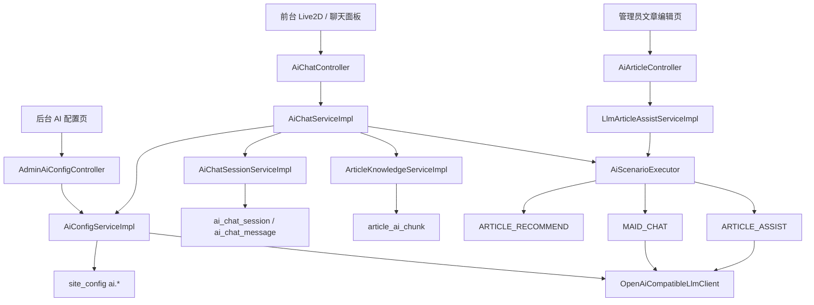

# Chen404 项目 AI 设计与接入文档

本文档描述 Chen404 当前已经落地的 AI 能力、运行链路、数据结构和前后端协作方式。最后同步时间：2026-05-25。

## 1. 当前 AI 能力总览

| 能力 | 入口 | 当前状态 | 核心实现 |
| ---- | ---- | ---- | ---- |
| 文章摘要/标签生成 | `POST /articles/ai/assist` | 已上线 | `ARTICLE_ASSIST` 场景 |
| Lyra 同步聊天 | `POST /ai/chat` | 已上线 | `MAID_CHAT` 场景 + 知识检索 + 会话持久化 |
| Lyra 流式聊天 | `POST /ai/chat/stream` | 已上线 | SSE + LLM streaming |
| 历史会话恢复 | `GET /ai/chat/sessions/{sessionId}` | 已上线 | `ai_chat_session` + `ai_chat_message` |
| 相关推荐 | 聊天响应中的 `relatedArticles` | 已上线，规则版 | `ARTICLE_RECOMMEND` 场景 |
| AI 后台配置 | `/admin/ai/config/**` | 已上线 | `AiConfigService` + `site_config ai.*` |

当前 AI 的定位不是完整 AI 平台，而是“可持续演进的应用能力层”：业务层不直接操作模型协议，AI 能力沉淀为场景，模型配置和 Lyra 表现可以在后台调试。

## 2. 总体架构



## 3. 分层职责

### Controller 层

- `AiArticleController`：文章摘要与标签生成。
- `AiChatController`：Lyra 同步聊天、流式聊天、会话恢复。
- `AdminAiConfigController`：后台 AI 配置读取、保存、连接测试。

### 业务编排层

- `LlmArticleAssistServiceImpl`：校验文章 AI 请求，调用场景执行器。
- `AiChatServiceImpl`：识别场景、加载文章、检索知识、保存会话、组装响应、发送 SSE。
- `AiConfigServiceImpl`：合成有效配置、保存私有配置、API Key 脱敏、测试模型连接。

### AI Application Layer

- `AiScenarioExecutor`
- `AiScenarioDefinition`
- `AiScenarioCode`
- `AiScenarioRequest`
- `AiScenarioResult`

当前场景：

- `ARTICLE_ASSIST`
- `MAID_CHAT`
- `ARTICLE_RECOMMEND`

### Provider Adapter

- `LlmClient`
- `OpenAiCompatibleLlmClient`
- `LlmTextRequest`
- `LlmTextStreamHandler`

`OpenAiCompatibleLlmClient` 支持 `chat-completions` 与 `responses` 两种 API 风格，并支持单次请求覆盖 model、baseUrl、apiKey、temperature、maxTokens、timeout 等参数。

## 4. 配置优先级

运行时 AI 配置优先级：

```text
后台 site_config ai.* 私有配置
  -> application.yml / profile / 环境变量默认值
```

默认配置来源：

- `LlmProperties`
- `AiRuntimeProperties`
- `AiMaidProperties`
- `src/main/resources/prompts/ai/*.txt`

后台配置来源：

- `AdminAiConfigController`
- `AiConfigServiceImpl`
- `site_config` 中 `ai.*` 且 `is_public = 0` 的配置项

敏感字段：

- `ai.llm.api_key` 只在服务端使用。
- admin 查询接口只返回 `apiKeyConfigured` 和 `apiKeyPreview`。
- 保存时空字符串表示保留旧 key，非空字符串表示替换 key。

## 5. 场景设计

### 5.1 `ARTICLE_ASSIST`

入口：

- `POST /articles/ai/assist`

目标：

- 根据标题和正文生成中文摘要。
- 给出标签建议。
- 支持重新生成时避开当前已有结果。

关键实现：

- `LlmArticleAssistServiceImpl`
- `ArticleAssistScenarioDefinition`

### 5.2 `MAID_CHAT`

入口：

- `POST /ai/chat`
- `POST /ai/chat/stream`
- `GET /ai/chat/sessions/{sessionId}`

场景：

- `HELPER`：当前文章/页面助手。
- `COMPANION`：陪伴聊天。

关键实现：

- `AiChatServiceImpl.resolveScene(...)`
- `AiChatServiceImpl.buildExecutionContext(...)`
- `MaidChatScenarioDefinition`
- `ArticleKnowledgeServiceImpl`
- `AiChatSessionServiceImpl`

当前聊天响应字段：

| 字段 | 用途 |
| ---- | ---- |
| `panelAnswer` | 聊天面板完整回答，可承载总结、解释、长回答 |
| `bubbleText` | Live2D 人物旁小气泡短句 |
| `replyText` | 兼容旧前端，当前等于 `panelAnswer` |
| `mood` | Lyra 情绪状态 |
| `citations` | 站内引用片段 |
| `relatedArticles` | 相关推荐文章 |
| `suggestions` | 快捷追问按钮 |
| `traceId` | 调试追踪 ID |

重要约束：

- `panelAnswer` 不再被 180 字截断。
- `bubbleText` 独立压短，超过 `bubbleMaxChars` 时使用 `bubbleLongReplyText`。
- `maxSuggestionCount = 0` 时返回空建议，不 fallback 默认建议。

### 5.3 `ARTICLE_RECOMMEND`

当前为规则版推荐，不让模型直接生成文章列表。

主要逻辑：

- 排除当前文章。
- 只返回访问者可见文章。
- 同分类、共享标签、管理员推荐、关键词匹配加分。
- 返回 Top N。

原因：

- 推荐需要可控、稳定、可解释。
- 后续可以在规则召回基础上增加 AI rerank。

## 6. 站内知识检索

当前检索基于 MySQL 轻量切片，不是向量数据库。

数据表：

- `article_ai_chunk`

切片类型：

- `title`
- `summary`
- `content`

生命周期：

```text
Article create/update
  -> ArticleKnowledgeService.syncArticleChunks(articleId)
  -> delete old chunks
  -> rebuild title/summary/content chunks

Article delete
  -> ArticleKnowledgeService.removeArticleChunks(articleId)
```

检索流程：

1. 优先搜索当前文章切片。
2. 从用户 query 提取关键词。
3. 使用 MySQL `LIKE` 检索标题和切片正文。
4. 根据当前文章、关键词命中、片段类型重打分。
5. 通过访问权限过滤不可见文章。
6. 返回带分数和引用片段的 `ArticleKnowledgeHit`。

当前边界：

- 尚无 embedding。
- 尚无向量数据库。
- 尚无混合召回与 rerank。

## 7. 会话持久化

数据表：

| 表 | 作用 |
| ---- | ---- |
| `ai_chat_session` | 会话归属、来源页面、来源文章、最近消息时间 |
| `ai_chat_message` | user/assistant 消息、引用、推荐、建议、traceId 快照 |

会话归属支持：

- 登录用户：`user_id`
- 游客：`visitor_id`

读取或续用会话时会校验归属，避免串会话。

## 8. SSE 协议

`POST /ai/chat/stream` 使用标准 SSE。

事件类型：

- `session`
- `message_start`
- `delta`
- `citation`
- `related_articles`
- `suggestions`
- `done`
- `error`

前端消费位置：

- `Chen404Fro/src/api/ai.ts`
- `Chen404Fro/src/components/Live2D/Live2D.vue`
- `Chen404Fro/src/components/Live2D/Live2DChatPanel.vue`

## 9. 后台 AI 配置

入口：

- `GET /admin/ai/config`
- `PUT /admin/ai/config`
- `POST /admin/ai/config/test-connection`

配置范围：

- LLM enabled、baseUrl、model、apiStyle、apiKey、temperature、maxTokens、timeoutSeconds。
- Lyra name、personaVersion、systemPrompt、helperPrompt、companionPrompt。
- Chat enabled、retrievalEnabled、maxCitationCount、maxContextMessages、maxArticleContentChars、maxArticleSummaryChars、maxSuggestionCount、relatedArticleLimit、requireRecommendIntentForRelatedArticles。
- Bubble bubbleMaxChars、bubbleLongReplyText。
- Tools webSearchEnabled 预留开关。

详细设计见 [AI 女仆后台配置设计](AI女仆后台配置设计.md)。

## 10. 容错与降级

当前降级策略：

- LLM 未启用或配置不完整时返回 fallback。
- LLM 返回非 JSON 时，结构化聊天走 fallback。
- 当前文章加载失败时跳过 article context。
- 站内检索关闭或失败时跳过 citations。
- 推荐场景失败时跳过 `relatedArticles`。
- 流式聊天失败时发送 `error` 事件，并尽量保存可用消息。

## 11. 测试覆盖

重点测试：

- `AiScenarioExecutorTest`
- `ArticleAssistScenarioDefinitionTest`
- `LlmArticleAssistServiceImplTest`
- `MaidChatScenarioDefinitionTest`
- `AiChatServiceImplTest`
- `AiChatSessionServiceImplTest`
- `ArticleRecommendScenarioDefinitionTest`
- `AiConfigServiceImplTest`
- `AdminAiConfigControllerTest`
- `OpenAiCompatibleLlmClientTest`

建议命令：

```bash
mvn "-Dtest=AiConfigServiceImplTest,AdminAiConfigControllerTest,MaidChatScenarioDefinitionTest,AiChatServiceImplTest,OpenAiCompatibleLlmClientTest" test
```

## 12. 后续演进方向

优先级建议：

1. Prompt 版本记录与恢复默认按钮。
2. API Key 服务端加密存储。
3. AI 调用日志、成本统计、限流和审计。
4. 站内检索升级为关键词召回 + embedding + rerank。
5. 推荐能力独立服务化，并增加 AI rerank 或推荐理由生成。
6. `webSearchEnabled` 接入真实联网搜索工具。
