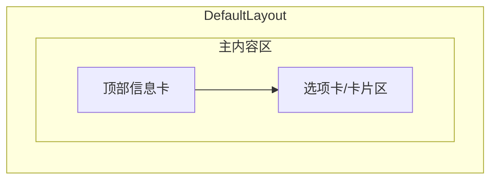

# 个人中心页面搭建 - 实现建议与计划

## 现状简要

- **路由**：Header 下拉已有「个人中心」并跳转 `/profile`，但 [router/index.ts](Chen404Fro/src/router/index.ts) 中未定义 `/profile`，会落到 404。
- **用户数据**：[stores/user.ts](Chen404Fro/src/stores/user.ts) 已有 `user`、`updateUserInfo`；[api/auth.ts](Chen404Fro/src/api/auth.ts) 有 `getUserInfo()`，当前为 `get('/auth/info')`，而后端 [AuthController](Chen404Bac/src/main/java/com/chen404/controller/AuthController.java) 为 `@PostMapping("/info")`，需前后端统一（见下）。
- **风格**：[variables.scss](Chen404Fro/src/assets/styles/variables.scss) 已定义樱花粉主色 `--primary: #fb7299`、圆角/阴影/间距；[Login.vue](Chen404Fro/src/views/Auth/Login.vue) 为典型二次元柔和风：左右分栏、左侧渐变 banner、装饰圆圈、右侧白底圆角表单。

---

## 一、页面结构与功能建议

### 1. 布局与模块划分

建议采用 **单页多卡片** 布局（与首页、登录页同属 DefaultLayout，保持左侧 Live2D + 中间主区）：

- **顶部信息卡**：头像（大圆）+ 昵称 + 用户名 + 一句副标题/签名（若后端暂无「签名」字段可先写死如「欢迎回来 ~」），背景用与登录页一致的 `linear-gradient(135deg, var(--primary), var(--primary-light))`，配合少量装饰圆/气泡，保持二次元柔和感。
- **下方卡片区**（建议用 Element Plus `el-tabs` 或多个 `el-card` 纵向排列）：
  - **基本信息**：展示 用户名、昵称、邮箱、注册时间 等（来自 `user`）；若后续有「编辑资料」需求，可在此卡片内做表单。
  - **修改密码**：表单（当前密码、新密码、确认新密码），提交调用已有 `changePassword`。
  - **快捷入口**：如「我的文章」跳转 `/article/edit`、或后续「我的评论」等，用图标+文字的小卡片或按钮呈现。

未登录访问 `/profile` 时，由路由守卫跳转登录并带上 `redirect=/profile`，与现有 `requiresAuth` 逻辑一致。

### 2. 数据流与接口对齐

- **获取当前用户**：页面进入时若 store 中无 `user` 或希望拿最新数据，可调用 `getUserInfo()`。注意：后端为 **POST** `/auth/info`，前端目前为 **GET**，需二选一修正：
  - **方案 A（推荐）**：后端增加 `GET /auth/info`，与 REST 语义一致，前端继续用 `get('/auth/info')`。
  - **方案 B**：前端改为 `post('/auth/info')` 或 `post('/auth/info', {})`，与现后端一致。
- **头像**：已有上传接口（Upload 头像），若用户有 `user.avatar` 则展示，否则用默认占位图（可沿用 Header 头像占位或统一默认图）。
- **更新资料**：当前后端无「更新用户资料」接口；若本期只做「展示 + 修改密码」，可不做编辑资料；若要做编辑昵称/头像链接，需在后端新增如 `PUT /auth/profile` 或 `PATCH /user/profile`，并在前端增加表单与 `updateUserInfo` 的联动。

---

## 二、二次元柔和漫画风落地建议

与 [Login.vue](Chen404Fro/src/views/Auth/Login.vue)、[variables.scss](Chen404Fro/src/assets/styles/variables.scss) 保持一致即可：

| 元素 | 建议 |

|------|------|

| **主色/渐变** | 顶部区用 `linear-gradient(135deg, var(--primary), var(--primary-light))`，与登录左侧 banner 一致。 |

| **卡片** | 白底/深色主题下用 `var(--bg-secondary)`，`border-radius: var(--radius-xl)`，`box-shadow: var(--shadow-md)` 或 `var(--shadow-lg)`。 |

| **装饰** | 顶部信息区可加 2～3 个 `position: absolute` 的圆形/椭圆，`background: rgba(255,255,255,0.1)` 左右，避免过于抢眼。 |

| **字体与间距** | 标题用较大字号与 600 字重；正文用 `var(--text-primary)` / `var(--text-secondary)`；块间距用 `var(--spacing-lg)`、`var(--spacing-xl)`。 |

| **表单** | 输入框、按钮与登录页一致：圆角 `var(--radius-md)`，主按钮用 primary，表单项间距统一。 |

| **暗色** | 使用 CSS 变量（如 `var(--bg-secondary)`、`var(--text-primary)`），保证 `data-theme="dark"` 下自动适配。 |

不引入新设计系统，仅复用现有变量与登录/首页的布局方式，即可保持「二次元柔和漫画风」统一。

---

## 三、实现步骤建议（按顺序）

1. **路由与守卫**

   - 在 [router/index.ts](Chen404Fro/src/router/index.ts) 中新增 `/profile`，`meta: { title: '个人中心', requiresAuth: true }`，组件指向新建的 Profile 视图。

2. **前后端接口统一**

   - 任选其一：后端为 `/auth/info` 增加 GET 支持，或前端 `getUserInfo()` 改为 `post('/auth/info')`（或带空 body 的 post），并确保请求带 Token（现有 request 拦截器应已带）。

3. **新建个人中心视图**

   - 路径建议：`Chen404Fro/src/views/Profile/Profile.vue`（或 `User/Profile.vue`）。
   - 使用 DefaultLayout；顶部信息卡（头像 + 昵称 + 用户名 + 副标题）+ 下方卡片区（基本信息、修改密码、快捷入口）。
   - 从 `useUserStore()` 取 `user`，必要时 `onMounted` 时调 `getUserInfo()` 再 `setUser` 更新 store；头像用 `user.avatar` 或默认图。

4. **修改密码区块**

   - 表单：当前密码、新密码、确认新密码；校验（非空、新密码长度、两次一致）；提交调用 `changePassword`，成功后提示并清空表单；错误用 `ElMessage` 提示。

5. **样式**

   - 使用 `variables.scss` 与 Login 的渐变/圆角/阴影/装饰写法；scoped + 必要时对 Element 组件做 `:deep()` 覆盖，保持与全站一致。

6. **（可选）编辑资料与后端**

   - 若需要「编辑昵称/头像」：后端新增更新 profile 接口；前端在基本信息卡片内增加编辑表单与提交逻辑，成功后调用 `updateUserInfo` 并可选再调 `getUserInfo()` 以同步。

---

## 四、文件与改动清单（建议）

| 类型 | 路径 | 说明 |

|------|------|------|

| 前端-路由 | [Chen404Fro/src/router/index.ts](Chen404Fro/src/router/index.ts) | 新增 `path: '/profile'`, `meta.requiresAuth: true` |

| 前端-视图 | `Chen404Fro/src/views/Profile/Profile.vue`（新建） | 个人中心页：信息卡 + 基本信息 + 修改密码 + 快捷入口 |

| 前端-API | [Chen404Fro/src/api/auth.ts](Chen404Fro/src/api/auth.ts) | 将 `getUserInfo` 改为与后端一致（GET 或 POST，见上） |

| 后端（可选） | [AuthController.java](Chen404Bac/src/main/java/com/chen404/controller/AuthController.java) | 若选方案 A：增加 `@GetMapping("/info")` 返回当前用户 |

---

## 五、小结与建议选择

- **风格**：完全沿用现有 `variables` + Login 的渐变、圆角、阴影、装饰圆，不新增设计 token，即可保持二次元柔和漫画风。
- **功能**：首版建议只做「展示基本信息 + 修改密码 + 快捷入口」；编辑资料与后端更新接口可放到第二步。
- **接口**：优先统一「获取当前用户」的 HTTP 方法（推荐后端增加 GET `/auth/info`，前端保持 `get`），避免 profile 页拉取用户信息失败。

按上述步骤即可完成个人中心页的搭建，并在风格上与全站保持一致。