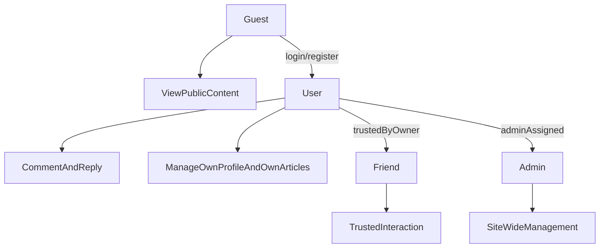

# 博客权限设计方案

## 当前状态

当前项目的权限模型比较轻量，核心特征是“公开浏览 + 登录后操作 + 管理员特权”，但还没有形成完整的权限体系。

前端现状：

- 路由主要依赖 [`d:\code_repo\Chen404\Chen404Fro\src\router\index.ts`](d:\code_repo\Chen404\Chen404Fro\src\router\index.ts) 中的 `requiresAuth` 和 `requiresAdmin`。
- 登录态主要来自 [`d:\code_repo\Chen404\Chen404Fro\src\stores\user.ts`](d:\code_repo\Chen404\Chen404Fro\src\stores\user.ts) 的 `token + user`，但路由守卫实际上只检查 `localStorage.token`，前后判断标准并不完全一致。
- 管理员判断依赖前端本地 `user.role === 1`，这只能做 UI 限制，不能当作真正安全边界。

后端现状：

- JWT 校验主要由 [`d:\code_repo\Chen404\Chen404Bac\src\main\java\com\chen404\interceptor\JwtInterceptor.java`](d:\code_repo\Chen404\Chen404Bac\src\main\java\com\chen404\interceptor\JwtInterceptor.java) 完成，请求通过后只把 `userId` 放进 request attribute。
- 管理员能力通过 [`d:\code_repo\Chen404\Chen404Bac\src\main\java\com\chen404\aspect\RequireAdminAspect.java`](d:\code_repo\Chen404\Chen404Bac\src\main\java\com\chen404\aspect\RequireAdminAspect.java) 做 AOP 校验，逻辑是“角色 ID = 1 即管理员”。
- [`d:\code_repo\Chen404\Chen404Bac\src\main\java\com\chen404\controller\ArticleController.java`](d:\code_repo\Chen404\Chen404Bac\src\main\java\com\chen404\controller\ArticleController.java) 的更新/删除目前只校验“是否登录”，还没有严格校验“是否作者本人或管理员”。
- 评论、友链等“访客互动能力”在前端已有规划，但后端当前并未完整落地，因此适合现在先把权限模型设计清楚，再按模块补实现。

## 推荐的目标权限分层

对于“个人博客，但支持好友来参观、评论、互动”的场景，建议不要一开始做复杂 RBAC，而是采用 4 层模型：

1. `游客 Guest`

- 可以访问：首页、文章详情、分类、标签、归档、关于页、好友页
- 可以查看公开评论
- 不能发文、不能进个人中心、不能管理后台
- 是否允许直接评论：建议可配置，而不是默认全部开放

2. `注册用户 User`

- 拥有游客全部权限
- 可以登录、维护自己的资料
- 可以发表评论、回复评论、点赞
- 可以创建和管理“自己的”文章草稿或投稿内容
- 不能管理站点全局内容

3. `好友 Friend` 或 `受信用户 TrustedUser`

- 这是最适合你博客场景的一层
- 本质上仍是普通登录用户，但额外拥有“更高互动权限”
- 适合放开：免审核评论、可见好友专属页面、友链申请更高优先级、特殊留言板入口
- 不建议给好友站点管理权限；好友是“互动身份”，不是“运维身份”

4. `管理员 Admin`

- 拥有全站管理权限
- 可管理：文章、分类、标签、评论审核、用户状态、友链审核、站点配置、文件管理
- 管理员权限必须只在后端强校验，前端仅做导航展示辅助

## 为什么建议加 `Friend`

你的博客不是纯社区产品，也不是纯匿名留言墙，所以“普通用户”和“管理员”之间还缺一层“关系型信任身份”。

这一层的价值：

- 你可以允许大多数人公开浏览
- 你可以允许注册用户正常互动
- 你可以对熟人/好友给更高的互动自由度，而不把他们提升成管理员
- 后续如果你想做“好友可见文章”“好友专属留言区”“友链白名单”等功能，会非常自然

建议实现方式：

- 先不要把 `Friend` 做成复杂角色体系
- 第一阶段只加一个用户属性，例如 `userType` / `trustLevel` / `isFriend`
- 等后面真的出现更多权限差异，再升级成角色 + 权限点模型

## 推荐的权限边界

### 内容访问

- 文章默认分为：`公开`、`仅登录可见`、`仅好友可见`、`私密/草稿`
- 目前你的博客以公开内容为主，建议先保留：`公开 + 草稿`
- 如果以后你想写生活向或只给熟人看的内容，再增加“仅好友可见”

### 评论系统

建议按“评论策略”而不是“单一登录限制”设计：

- 游客评论：默认关闭，除非你很确定要做验证码 + 风控
- 注册用户评论：开启
- 好友评论：可免审核
- 普通用户评论：可走内容审核或频控
- 管理员：可删除、置顶、隐藏、审核评论

这比“所有人都能评”更适合个人博客，也能明显降低垃圾评论风险。

### 文章管理

建议明确为：

- 作者本人：可编辑、删除自己的文章
- 管理员：可编辑、删除任意文章
- 其他登录用户：不能操作别人的文章

这一点应该优先修正，因为这是当前最明显的权限漏洞。

### 后台管理

后台能力建议拆成两类：

- `内容管理`：文章、分类、标签、评论、友链
- `系统管理`：用户、角色、站点配置、上传资源、日志

如果短期只有你一个维护者：

- 先统一收口到 `Admin`
- 不必现在就拆出 `Editor`

如果以后想让别人帮你管内容：

- 再增加 `Editor` 角色
- `Editor` 只管文章/评论，不管用户和系统设置

## 推荐的数据模型演进

短期最适合你的实现，不是一步上完整 RBAC，而是分两阶段。

### 第一阶段：够用且简单

保留现有 `User` + `Role` 基础，只做小升级：

- 保留 `USER` / `ADMIN`
- 在用户表增加一个“关系/信任级别”字段，例如：`trust_level` 或 `is_friend`
- 在文章表增加一个 `visibility` 字段，例如：`public` / `friend` / `private`
- 在评论表增加 `status` 字段，例如：`pending` / `approved` / `rejected`

这样就足够支撑：

- 公开文章
- 好友可见文章
- 注册用户评论
- 评论审核
- 管理员后台治理

### 第二阶段：需要时再升级

当你真正出现更多后台协作者时，再升级为：

- 角色：`USER`、`FRIEND`、`EDITOR`、`ADMIN`
- 权限点：`article:create`、`article:update:own`、`comment:review`、`friendlink:audit` 等

这时再让后端按权限点判定，而不是硬编码 `role == 1`。

## 推荐的后端实现方向

后端建议逐步从“登录校验”和“管理员校验”演进成“资源所有权 + 角色/关系校验”。

优先级建议：

1. 修资源所有权

- 文章更新/删除时校验：作者本人或管理员
- 文件删除时校验：上传者本人或管理员

2. 抽统一权限判断

- 例如增加 `PermissionService` / `AccessService`
- 封装：`canEditArticle(userId, articleId)`、`canComment(userId, articleVisibility)`、`canViewArticle(user, article)`

3. 减少 magic number

- 不再把管理员写死成 `role == 1`
- 优先改成基于 `roleCode = admin` 或枚举常量判断

4. 评论与好友模块按策略开放

- 评论接口支持游客/登录/好友三级策略配置
- 好友身份不要默认继承管理权限

## 推荐的前端实现方向

前端不要承担真正安全校验，但要承担“体验层权限展示”。

建议：

- 路由守卫只负责基础访问控制：未登录、非管理员
- 页面内操作按钮再按 `isOwner`、`isAdmin`、`isFriend` 做展示
- 后端返回明确的权限字段会更好，例如：
  - `canEdit`
  - `canDelete`
  - `canComment`
  - `canReply`

这样前端不会因为本地推断错误而出现 UI 与真实权限不一致。

## 建议的最终权限模型

## 我给你的结论

最适合当前项目的方案不是直接上复杂 RBAC，而是：

- 先保留现在的 `普通用户 / 管理员` 基础结构
- 补上一层“好友/受信用户”概念
- 把真正重要的权限先落到“资源所有权”和“评论策略”上
- 等以后真的有多人协作后台，再升级成更细的角色和权限点

换句话说，现阶段最实用的权限设计应该是：

- 浏览：默认公开
- 互动：登录用户可参与，好友可更自由
- 创作：用户只能管理自己的内容
- 治理：只有管理员能做全站管理

这会比“所有登录用户都差不多”更安全，也比“一开始就做复杂 RBAC”更贴合你的个人博客场景。