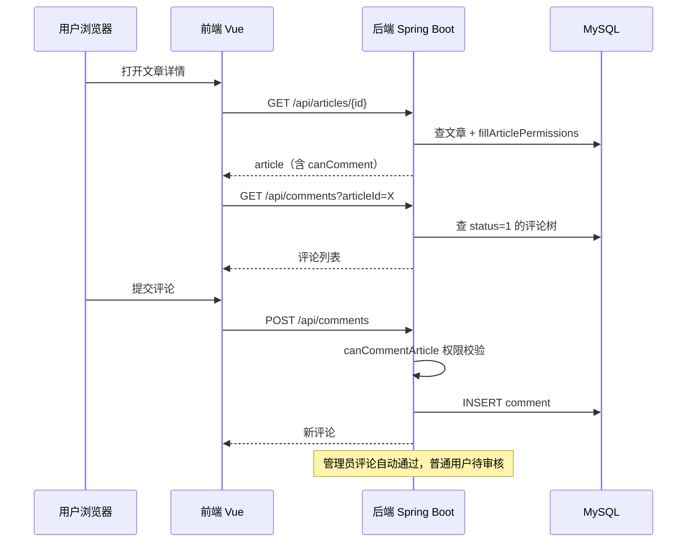

# 评论功能实现计划

## 现状盘点

已有基础设施（不需要重建）：

- **数据库**：`comment` 表已在 `chen404-unified.sql` 中定义，含 `parent_id`/`root_id` 支持嵌套回复
- **后端权限**：`AccessService.canCommentArticle()` 已实现，支持 4 种 `comment_policy`
- **后端拦截**：`JwtInterceptor` 已对 `/comments` 做 GET 公开、写操作需 JWT
- **前端类型**：`Comment`、`CreateCommentParams`、`CommentStatus`、`RecentComment` 已定义在 [src/types/index.ts](d:\code_repo\Chen404\Chen404Fro\src\types\index.ts)
- **前端 API**：[src/api/comment.ts](d:\code_repo\Chen404\Chen404Fro\src\api\comment.ts) 已写好全套接口（getComments、createComment、deleteComment、reviewComment、likeComment）
- **文章详情**：已返回 `canComment` 字段，但前端未使用

需要新建的部分：

## 第一阶段：后端 CRUD

### 1. Comment 实体

新建 [Comment.java](d:\code_repo\Chen404\Chen404Bac\src\main\java\com\chen404\domain\entity\Comment.java)，映射 `comment` 表，字段与 SQL DDL 一一对应。关键点：

- `@TableName("comment")`
- `@TableLogic` 标注 `deleted`
- 新增 `@TableField(exist = false)` 的 `children` 列表（用于嵌套返回）
- 定义内部接口 `Status`（PENDING=0, APPROVED=1, REJECTED=2）

### 2. CommentMapper

新建 [CommentMapper.java](d:\code_repo\Chen404\Chen404Bac\src\main\java\com\chen404\mapper\CommentMapper.java)，继承 `BaseMapper<Comment>`。额外自定义：

- `incrementLikeCount(Long id)` -- 原子 +1
- `selectCountByArticleId(Long articleId)` -- 统计已通过评论数（用于同步 `article.comment_count`）

### 3. DTO

新建以下 DTO：

- [CreateCommentDTO.java](d:\code_repo\Chen404\Chen404Bac\src\main\java\com\chen404\domain\dto\CreateCommentDTO.java)：`articleId`（可选）、`parentId`、`content`、`authorName`、`authorEmail`、`authorWebsite`
- [ReviewCommentDTO.java](d:\code_repo\Chen404\Chen404Bac\src\main\java\com\chen404\domain\dto\ReviewCommentDTO.java)：`status`（1=通过 / 2=拒绝）

### 4. CommentService

新建 [CommentService.java](d:\code_repo\Chen404\Chen404Bac\src\main\java\com\chen404\service\CommentService.java) 接口 + [CommentServiceImpl.java](d:\code_repo\Chen404\Chen404Bac\src\main\java\com\chen404\service\impl\CommentServiceImpl.java)

核心方法：

- `getCommentsByArticleId(Long articleId, int page, int size)` -- 查已通过的顶级评论 + 子评论树
- `getGuestbookComments(int page, int size)` -- `article_id IS NULL` 的留言板评论
- `getRecentComments(int limit)` -- 最新 N 条（跨文章）
- `createComment(CreateCommentDTO dto, Long userId, String ip, String userAgent)` -- 权限校验（调用 `accessService.canCommentArticle`）、填充登录用户信息、设置 `root_id`、自动审核管理员评论
- `deleteComment(Long id, Long userId)` -- 仅本人或管理员
- `reviewComment(Long id, int status)` -- 管理员审核，通过后同步 `article.comment_count`
- `likeComment(Long id)` -- 原子递增

关键逻辑：

- 创建评论时：如果 `parentId != 0`，查父评论获取 `rootId`（顶级评论的 `rootId = 自身 id`）
- 登录用户自动填充 `authorName/authorAvatar/authorId`，覆盖客户端提交值
- 管理员评论自动 `status = APPROVED` + `isAdmin = 1`
- 普通用户评论默认 `status = PENDING`（待审核）
- 审核通过后重新统计并更新 `article.comment_count`

### 5. CommentController

新建 [CommentController.java](d:\code_repo\Chen404\Chen404Bac\src\main\java\com\chen404\controller\CommentController.java)

端点设计（对齐前端 `api/comment.ts` 已定义的路径）：

- `GET /comments` -- 公开，按 `articleId` 分页查评论树
- `GET /comments/guestbook` -- 公开，留言板评论
- `GET /comments/recent` -- 公开，最新评论
- `POST /comments` -- 需登录（或游客，取决于 policy），发表评论
- `DELETE /comments/{id}` -- 需登录，删除自己的评论或管理员删除
- `POST /comments/{id}/like` -- 公开，点赞

### 6. AdminCommentController

新建 [AdminCommentController.java](d:\code_repo\Chen404\Chen404Bac\src\main\java\com\chen404\controller\AdminCommentController.java)

- `PUT /admin/comments/{id}/review` -- `@RequireAdmin`，审核评论

### 7. 补充调整

- 修改 [ArticleMapper.java](d:\code_repo\Chen404\Chen404Bac\src\main\java\com\chen404\mapper\ArticleMapper.java) 的 `selectSiteStats` 中评论统计，确保只统计 `status = 1`（已通过）
- 修改 [HomeController.java](d:\code_repo\Chen404\Chen404Bac\src\main\java\com\chen404\controller\HomeController.java)（如有 recentComments 接口）接入 CommentService

---

## 第二阶段：前端组件和页面

### 8. CommentSection 组件

新建 [CommentSection.vue](d:\code_repo\Chen404\Chen404Fro\src\components\Comment\CommentSection.vue)

功能：

- Props：`articleId`（可选，留言板不传）、`canComment`（布尔）、`commentPolicy`
- 评论列表（分页加载）
- 评论表单（登录用户显示头像+昵称，未登录显示昵称/邮箱输入框）
- 回复功能（点击"回复"展开子表单）
- 展示嵌套评论树（两级：根评论 + 子评论平铺或缩进）

### 9. CommentItem 组件

新建 [CommentItem.vue](d:\code_repo\Chen404\Chen404Fro\src\components\Comment\CommentItem.vue)

功能：

- 单条评论卡片：头像、昵称、时间、内容、点赞、回复按钮
- 管理员标识（`isAdmin` 徽章）
- 删除按钮（本人或管理员可见）
- 子评论列表递归渲染

### 10. 接入 ArticleDetail

修改 [ArticleDetail.vue](d:\code_repo\Chen404\Chen404Fro\src\views\Article\ArticleDetail.vue)：

- 在文章正文下方引入 `<CommentSection :articleId="article.id" :canComment="article.canComment" />`
- 根据 `canComment` 显示/隐藏评论表单
- 评论策略为 `CLOSED` 时显示"评论已关闭"提示

### 11. 接入 Guestbook

修改 [Guestbook.vue](d:\code_repo\Chen404\Chen404Fro\src\views\Guestbook\Guestbook.vue)：

- 移除现有硬编码 mock 数据
- 引入 `<CommentSection :canComment="true" />`（不传 `articleId`，即留言板模式）

### 12. 前端类型补充

检查 [src/types/index.ts](d:\code_repo\Chen404\Chen404Fro\src\types\index.ts) 中 `Comment` 接口是否需要补充 `authorAvatar`、`authorId`、`isAdmin`、`likeCount`、`rootId` 等字段（当前定义可能缺少部分）。

---

## 数据流总览

## 不在本次范围

- 评论邮件通知（可后续扩展）
- 评论表情/Markdown 渲染（可后续扩展）
- 管理后台评论列表页（可后续用 Admin 页面补）